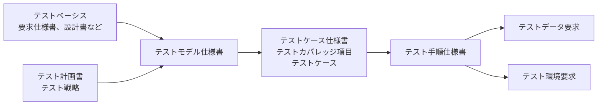

# テスト文書ガイドライン

## 目次

1. [概要](#1-概要)
2. [準拠する規格](#2-準拠する規格)
3. [テスト文書の種類](#3-テスト文書の種類)
4. [共通情報](#4-共通情報)
5. [テストモデル仕様書](#5-テストモデル仕様書)
6. [テストケース仕様書](#6-テストケース仕様書)
7. [テスト手順仕様書](#7-テスト手順仕様書)
8. [テストデータ要求](#8-テストデータ要求)
9. [テスト環境要求](#9-テスト環境要求)
10. [識別子と追跡](#10-識別子と追跡)
11. [文書の形式](#11-文書の形式)
12. [参考資料](#12-参考資料)

---

## 1. 概要

本書は、テスト仕様書とそれに付随する要求文書を、ISO/IEC/IEEE 29119-3:2021に準拠して作成する方法を定める。本書は、[規格準拠文書ガイドライン](standard-conformance-guidelines.md)を前提とする。

テストの対象は、ソフトウェアに限らず、システム、ハードウェアを含むシステム、要求仕様書や利用者向けの手引きのような文書でもよい。どのテストケースを選び、何を検証するかは[テストガイドライン](../software/testing-guidelines.md)に従う。

---

## 2. 準拠する規格

### ISO/IEC/IEEE 29119-3:2021に準拠する

テスト文書は、ISO/IEC/IEEE 29119-3:2021に準拠して作成する。同規格は、テストプロセスが作成するテスト文書の種類と、各文書に書く情報項目を定める。2013年の初版で使っていたテスト条件（test condition）は、第2版でテストモデル（test model）に置き換えられた。

| 規格 | 本書での使い方 |
| --- | --- |
| ISO/IEC/IEEE 29119-3:2021 | 準拠する対象とする。文書の種類、共通情報、情報項目と要否を定める。 |
| ISO/IEC/IEEE 29119-2:2021 | どのテストプロセスがどの文書を作成し、使用するかを確認する。 |
| ISO/IEC/IEEE 29119-1:2022 | テストの概念と用語を確認する。 |
| ISO/IEC/IEEE 29119-4:2021 | テストモデルの作成、テストカバレッジ項目の特定、テストケースの導出に使うテスト設計技法を確認する。 |

IEEE 829-2008はISO/IEC/IEEE 29119-3に置き換えられているため、準拠の対象にしない。

### 準拠の種類を宣言する

準拠の種類は、完全準拠とテーラリング準拠のどちらかを選び、各文書に記載する。

| 準拠の種類 | 内容 |
| --- | --- |
| 完全準拠 | 規格が定めるすべての文書を作成し、すべての情報項目を含める。 |
| テーラリング準拠 | 利害関係者と合意したうえで、作成する文書と情報項目を絞り込む。省略した文書と情報項目、その理由、合意した利害関係者を記録する。 |

スクリプトテストと探索的テストの両方を行う場合は、探索的テストがテスト設計・実装プロセスの要求を満たさなくても、要求を満たすスクリプトテストについて完全準拠を宣言できる。

---

## 3. テスト文書の種類

### 規格が定める文書の一覧

ISO/IEC/IEEE 29119-3:2021は、テストプロセスの階層ごとに次の文書を定める。本書は、「本書での扱い」の列がテスト仕様書、またはテスト仕様書に付随する要求である文書を扱う。

| 階層 | 文書 | 規格の箇条 | 内容 | 本書での扱い |
| --- | --- | --- | --- | --- |
| 組織 | Test policy（テスト方針） | 6.2 | 組織におけるテストの目的、目標、原則、範囲を示す。 | 対象外 |
| 組織 | Organizational test practices（組織のテスト実践） | 6.3 | 組織の中でテストをどう行うかを、推奨する方法として示す。 | 対象外 |
| テストマネジメント | Test plan（テスト計画書） | 7.2 | テストの目的と、それを達成する手段と日程を示す。テスト戦略を含む。 | 対象外 |
| テストマネジメント | Test status report（テスト状況報告書） | 7.3 | 報告期間ごとのテストの状況を示す。 | 対象外 |
| テストマネジメント | Test completion report（テスト完了報告書） | 7.4 | 実施したテストの結果をまとめる。 | 対象外 |
| 動的テスト | Test model specification（テストモデル仕様書） | 8.2 | テストモデルを定める。 | テスト仕様書 |
| 動的テスト | Test case specification（テストケース仕様書） | 8.3 | テストカバレッジ項目とテストケースを定める。 | テスト仕様書 |
| 動的テスト | Test procedure specification（テスト手順仕様書） | 8.4 | テストケースを実行順に並べたテスト手順を定める。 | テスト仕様書 |
| 動的テスト | Test data requirements（テストデータ要求） | 8.5 | テストデータに必要な性質を定める。 | テスト仕様書に付随する要求 |
| 動的テスト | Test environment requirements（テスト環境要求） | 8.6 | テスト環境に必要な性質を定める。 | テスト仕様書に付随する要求 |
| 動的テスト | Test data readiness report（テストデータ準備状況報告書） | 8.7 | テストデータ要求ごとの準備状況を示す。 | 対象外 |
| 動的テスト | Test environment readiness report（テスト環境準備状況報告書） | 8.8 | テスト環境要求ごとの準備状況を示す。 | 対象外 |
| 動的テスト | Actual results and test result（実測結果とテスト結果） | 8.9 | テストケースの実行で観測した結果と、合否を示す。 | 対象外 |
| 動的テスト | Test execution log（テスト実行ログ） | 8.10 | テスト手順の実行を記録する。 | 対象外 |
| 動的テスト | Incident report（インシデント報告書） | 8.11 | テスト中に発生した事象の内容と状況を示す。 | 対象外 |

### テスト仕様書

テスト仕様書（test specification）は、特定のテスト対象について、テスト設計、テストケース、テスト手順を完全に文書化したものである。テストモデル仕様書、テストケース仕様書、テスト手順仕様書の3つで構成する。

### テスト仕様書に付随する要求

テストデータ要求とテスト環境要求は、テスト手順を実行するために必要なテストデータとテスト環境の性質を定める。テスト環境とテストデータを用意する担当者は、これらの要求に従って準備し、準備状況を報告書で示す。

### 文書間の導出関係

テスト仕様書は、テストベーシスからテストモデルを作り、テストモデルからテストカバレッジ項目を特定し、テストカバレッジ項目からテストケースを導出し、テストケースをテスト手順へ組み立てる順に作る。

---

## 4. 共通情報

規格は、すべてのテスト文書に共通する情報として次の項目を定める。テンプレートはすべての項目を含む。

5章から9章までの情報項目の表では、括弧内の名称をテンプレートの項目名に使う。

| 情報項目 | 規格の箇条 | 書く内容 | テンプレートの記載箇所 |
| --- | --- | --- | --- |
| Unique identifier（一意な識別子） | 5.2.1 | 文書を一意に特定する識別子。 | 文書情報の「文書識別子」 |
| Issuing organization（発行組織） | 5.2.2 | 文書を作成し、発行する組織。 | 文書情報の「発行組織」 |
| Approval authority（承認者） | 5.2.3 | 文書を承認する権限を持つ人物または役割。 | 文書情報の「承認者」 |
| Change history（変更履歴） | 5.2.4 | 版ごとの日付、変更内容、変更者。 | 「変更履歴」 |
| Status（状態） | 5.2.5 | 文書の状態。値は[仕様書作成ガイドライン](specification-guidelines.md)のステータスを使う。 | 文書情報の「ステータス」 |
| Introduction（はじめに） | 5.2.6 | 文書の目的と読み手。 | 「1.1 この文書の目的」 |
| Scope（範囲） | 5.2.7 | 文書が対象とするテスト対象、テストレベル、テストタイプと、対象外の範囲。 | 「1.2 対象の範囲」 |
| References（参照資料） | 5.2.8 | テストベーシス、テスト計画書など、文書が参照する資料と版。 | 「1.3 参照資料」 |
| Glossary（用語） | 5.2.9 | 文書で使う用語と、その定義。 | 「1.4 用語の定義」 |

準拠する規格、準拠の種類、テーラリングの内容は、各テンプレートの「1.5 規格への準拠」に記載する。

---

## 5. テストモデル仕様書

### 目的

テストモデル仕様書は、テスト対象のうち、テストで焦点を当てる特性や品質を表すテストモデルを定める。テストモデルは、テストカバレッジ項目を特定する基になる。

### 情報項目

規格の付属書Aは、次の情報項目をすべて必須（shall）と定める。情報項目は、テストモデル1件ごとに記載する。

| 情報項目 | 規格の箇条 | 要否 | 書く内容 |
| --- | --- | --- | --- |
| Unique identifier（識別子） | 8.2.2 | 必須 | テストモデルの識別子。 |
| Objective（目的） | 8.2.3 | 必須 | テスト対象のどの特性や品質に焦点を当てるか。 |
| Priority（優先度） | 8.2.4 | 必須 | テストモデルの優先度。 |
| Test strategy extract（テスト戦略の抜粋） | 8.2.5 | 必須 | テスト計画書のテスト戦略のうち、このテストモデルに適用する部分。 |
| Test model（テストモデル） | 8.2.6 | 必須 | テスト対象を表現したモデルそのもの、またはモデルとして使う成果物への参照。 |
| Traceability（追跡） | 8.2.7 | 必須 | テストモデルが表現するテストベーシスの項目。 |

### テストモデルは求めるテストカバレッジごとに作る

テスト完了基準に含まれるテストカバレッジの種類が異なる場合は、種類ごとに別のテストモデルを作る。同値分割のカバレッジと状態遷移のカバレッジを求める場合は、同値クラスを表すモデルと状態遷移図を分けて作る。

### テスト戦略の抜粋には適用する技法と完了基準を書く

テスト戦略の抜粋には、このテストモデルに適用するテスト設計技法と、対応するテスト完了基準を書く。テストモデルとテスト戦略を読み合わせると、どのテストカバレッジ項目をどこまで網羅するかが決まる。

### テストモデルは表現の形を問わない

テストモデルには、要求文、同値クラス、状態遷移図、ユースケース記述、デシジョンテーブル、入力の構文、ソースコード、制御フローグラフ、パラメーターと値、クラシフィケーションツリー、自然言語を使える。表や図で書ける場合は、表またはMermaidの図で書く。要求仕様書やソースコードのような既存の成果物をそのままモデルとして使う場合は、版を含めてその箇所を参照する。

### 優先度はリスクに基づいて付ける

優先度は、テスト計画書のリスク評価に基づいて付け、テスト計画書または組織のテスト実践で定めた尺度で表す。

---

## 6. テストケース仕様書

### 目的

テストケース仕様書は、テストモデルから特定したテストカバレッジ項目と、それを実行するテストケースを定める。

### 情報項目

規格の付属書Aは、次の情報項目をすべて必須（shall）と定める。テストカバレッジ項目とテストケースは、それぞれ1件ごとに記載する。

| 区分 | 情報項目 | 規格の箇条 | 要否 | 書く内容 |
| --- | --- | --- | --- | --- |
| テストカバレッジ項目 | Unique identifier（識別子） | 8.3.2.2 | 必須 | テストカバレッジ項目の識別子。 |
| テストカバレッジ項目 | Description（説明） | 8.3.2.3 | 必須 | テストで焦点を当てる、テスト対象の測定できる属性。 |
| テストカバレッジ項目 | Priority（優先度） | 8.3.2.4 | 必須 | テストカバレッジ項目の優先度。 |
| テストカバレッジ項目 | Traceability（追跡） | 8.3.2.5 | 必須 | 導出元のテストモデル。 |
| テストケース | Unique identifier（識別子） | 8.3.3.2 | 必須 | テストケースの識別子。 |
| テストケース | Objective（目的） | 8.3.3.3 | 必須 | テストケースで確かめること。 |
| テストケース | Priority（優先度） | 8.3.3.4 | 必須 | テストケースの優先度。 |
| テストケース | Traceability（追跡） | 8.3.3.5 | 必須 | テストケースが実行するテストカバレッジ項目。 |
| テストケース | Preconditions（事前条件） | 8.3.3.6 | 必須 | 実行の前に成立しているテスト環境、データ、テスト対象の状態。 |
| テストケース | Inputs（入力） | 8.3.3.7 | 必須 | テストの実行で与えるデータ、情報、操作。 |
| テストケース | Expected results（期待結果） | 8.3.3.8 | 必須 | 指定した条件の下で、仕様またはほかの根拠から予測される、観測できるテスト対象の振る舞い。 |

### テストカバレッジ項目は測定できる単位で書く

テストカバレッジ項目は、同値クラス、状態間の遷移、実行可能な文のように、実行したかどうかを判定できる単位で書く。テストカバレッジは、特定したテストカバレッジ項目のうち、テストケースが実行したものの割合で表す。

### テストケースは実行の最小単位にする

テストケースは、事前条件、入力、期待結果の組である。テストケースの中に別のテストケースを含めない。

### 期待結果は観測できる振る舞いで書く

期待結果は、画面への出力、ハードウェアへの出力、データの変化、帳票、送信される通信メッセージのように、テストの実行で観測できる振る舞いで書く。期待結果はテストベーシスから導き、テスト対象の現在の動作から書き写さない。

### 実測結果とテスト結果はテストケース仕様書に書かない

実行で観測した実測結果と合否は、規格の8.9が定める別の情報項目として記録し、テストケース仕様書には書かない。

---

## 7. テスト手順仕様書

### 目的

テスト手順仕様書は、テストケースを実行順に並べ、事前条件を整える操作と実行後の後始末を加えたテスト手順を定める。規格はテストスクリプト（test script）を同義の名称として挙げる。

### 情報項目

規格の付属書Aは、次の情報項目をすべて必須（shall）と定める。情報項目は、テスト手順1件ごとに記載する。

| 情報項目 | 規格の箇条 | 要否 | 書く内容 |
| --- | --- | --- | --- |
| Unique identifier（識別子） | 8.4.2 | 必須 | テスト手順の識別子。 |
| Objective（目的） | 8.4.3 | 必須 | テスト手順で確かめること。 |
| Priority（優先度） | 8.4.4 | 必須 | テスト手順の優先度。 |
| Start up（開始） | 8.4.5 | 必須 | 最初のテストケースの事前条件を整えるために、実行の前に行う操作。 |
| Ordered test cases（実行順のテストケース） | 8.4.6 | 必須 | 実行するテストケースと、その実行順序。 |
| Relationship to other procedures（ほかの手順との関係） | 8.4.7 | 必須 | 先に実行する手順、並行して実行できる手順、後に実行する手順。 |
| Stop and wrap up（停止と後始末） | 8.4.8 | 必須 | 実行を止める操作と、実行後にテスト環境とデータを元に戻す操作。 |

### テストケースの間で事前条件を整える

直前のテストケースの実行後の状態が、次のテストケースの事前条件を満たさない場合は、その間に事前条件を整える操作を記載する。

### 自動テストのコードはテスト手順仕様書として使える

自動テストのコードがすべての情報項目を含む場合は、そのコードをテスト手順仕様書として使える。その場合は、文書からコードの位置と版を参照する。

---

## 8. テストデータ要求

### 目的

テストデータ要求は、テストケースの入力と事前条件を満たすために作成または選択するテストデータについて、必要な性質を定める。

### 情報項目

規格の付属書Aは、次の情報項目をすべて必須（shall）と定める。情報項目は、テストデータ要求1件ごとに記載する。

| 情報項目 | 規格の箇条 | 要否 | 書く内容 |
| --- | --- | --- | --- |
| Unique identifier（識別子） | 8.5.2 | 必須 | テストデータ要求の識別子。 |
| Description（説明） | 8.5.3 | 必須 | 必要なデータの内容、量、形式、入手元と、そのデータを使うテストケースまたはテスト手順。 |
| Responsibility（責任） | 8.5.4 | 必須 | データを用意し、維持する人物または役割。 |
| Period needed（必要な期間） | 8.5.5 | 必須 | データが使える状態で必要になる期間。 |
| Resetting needs（リセットの要否） | 8.5.6 | 必須 | 実行の間にデータを初期状態へ戻す必要があるか、あればその時点。 |
| Archiving or disposal（保管または廃棄） | 8.5.7 | 必須 | テストの終了後にデータを保管するか廃棄するか、その方法。 |

### データの入手元を明記する

テストデータは、テスト対象の内部に置く場合も、ほかのシステム、ハードウェア機器、操作者のような外部から得る場合もある。どこから得るデータかを説明に書く。

---

## 9. テスト環境要求

### 目的

テスト環境要求は、テストの実行に必要な設備、ハードウェア、ソフトウェア、ファームウェア、手順について、必要な性質を定める。

### 情報項目

規格の付属書Aは、次の情報項目をすべて必須（shall）と定める。情報項目は、テスト環境要求1件ごとに記載する。

| 情報項目 | 規格の箇条 | 要否 | 書く内容 |
| --- | --- | --- | --- |
| Unique identifier（識別子） | 8.6.2 | 必須 | テスト環境要求の識別子。 |
| Test environment item（テスト環境の要素） | 8.6.3 | 必須 | ハードウェア、ソフトウェア、インターフェース、周辺機器、ツールのように、テスト環境の中で個別に扱える要素。 |
| Description（説明） | 8.6.4 | 必須 | その要素に必要な性質。版、構成、性能、接続先、台数など。 |
| Responsibility（責任） | 8.6.5 | 必須 | 要素を用意し、維持する人物または役割。 |
| Period needed（必要な期間） | 8.6.6 | 必須 | 要素が使える状態で必要になる期間。 |

### ほかの文書にある要求は参照する

組織のテスト実践、テスト計画書、テスト仕様書にすでに記載されている要求は、複製せずに参照する。

---

## 10. 識別子と追跡

### 識別子の形式

識別子は[仕様書作成ガイドライン](specification-guidelines.md)の`<PREFIX>-<DOMAIN>-<NNN>`の形式にし、次のPREFIXを使う。一度付けた識別子は変更しない。

| 対象 | PREFIX | 識別子例 |
| --- | --- | --- |
| テストモデル | `TM` | `TM-ORDER-001` |
| テストカバレッジ項目 | `TCI` | `TCI-ORDER-001` |
| テストケース | `TC` | `TC-ORDER-001` |
| テスト手順 | `TP` | `TP-ORDER-001` |
| テストデータ要求 | `TDR` | `TDR-ORDER-001` |
| テスト環境要求 | `TER` | `TER-ORDER-001` |

### 追跡の向き

各情報項目の「追跡」は、1つ上流の要素を指す。テストベーシスの項目からテスト手順まで、識別子をたどって双方向に追跡できる状態にする。

| 要素 | 追跡先 |
| --- | --- |
| テストモデル | テストベーシスの項目（要求の識別子など） |
| テストカバレッジ項目 | テストモデル |
| テストケース | テストカバレッジ項目 |
| テスト手順 | 実行順のテストケースとして含むテストケース |

---

## 11. 文書の形式

### 文書を分けるか、まとめるかを選ぶ

テスト仕様書は、1つの文書にまとめても、テストモデル仕様書、テストケース仕様書、テスト手順仕様書に分けても、文書とテスト管理ツールの記録を組み合わせてもよい。どの形でも、各情報項目を含める。

### 紙以外の記録を使える

テスト文書は、テスト管理ツールの記録、表計算、マインドマップ、ホワイトボードの写真のような電子的な形でもよい。

### ひな形

ひな形は[テンプレート](../../templates/README.md)にある。

| 文書 | テンプレート |
| --- | --- |
| テストモデル仕様書 | [Test Model Specification](../../templates/documentation/test-model-specification.md) |
| テストケース仕様書 | [Test Case Specification](../../templates/documentation/test-case-specification.md) |
| テスト手順仕様書 | [Test Procedure Specification](../../templates/documentation/test-procedure-specification.md) |
| テストデータ要求 | [Test Data Requirements](../../templates/documentation/test-data-requirements.md) |
| テスト環境要求 | [Test Environment Requirements](../../templates/documentation/test-environment-requirements.md) |

---

## 12. 参考資料

| 本書の章 | 参考資料 | 説明 |
| --- | --- | --- |
| 2. 準拠する規格 3. テスト文書の種類 4. 共通情報 5. テストモデル仕様書 6. テストケース仕様書 7. テスト手順仕様書 8. テストデータ要求 9. テスト環境要求 11. 文書の形式 | [ISO/IEC/IEEE 29119-3:2021 - Software and systems engineering — Software testing — Part 3: Test documentation](https://www.iso.org/standard/79429.html) | テスト文書の種類、共通情報、各文書の情報項目と要否（付属書A）、テストモデルの定義、準拠の種類、IEEE 829-2008との対応を定める。 |
| 2. 準拠する規格 3. テスト文書の種類 5. テストモデル仕様書 6. テストケース仕様書 7. テスト手順仕様書 8. テストデータ要求 9. テスト環境要求 | [ISO/IEC/IEEE 29119-2:2021 - Software and systems engineering — Software testing — Part 2: Test processes](https://www.iso.org/standard/79428.html) | テストプロセスと、テストケース、テスト手順、テストカバレッジ項目、テストデータ、テスト環境、テスト戦略の定義、スクリプトテストについての準拠の扱いを定める。 |
| 2. 準拠する規格 5. テストモデル仕様書 | [ISO/IEC/IEEE 29119-1:2022 - Software and systems engineering — Software testing — Part 1: General concepts](https://www.iso.org/standard/81291.html) | ISO/IEC/IEEE 29119シリーズで使うテストの概念を示す。 |
| 2. 準拠する規格 5. テストモデル仕様書 | [ISO/IEC/IEEE 29119-4:2021 - Software and systems engineering — Software testing — Part 4: Test techniques](https://www.iso.org/standard/79430.html) | テストモデルの作成、テストカバレッジ項目の特定、テストケースの導出に使うテスト設計技法を定める。 |
