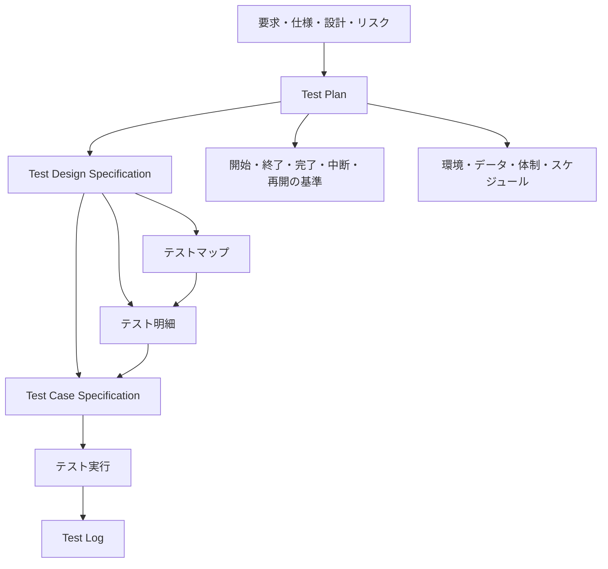
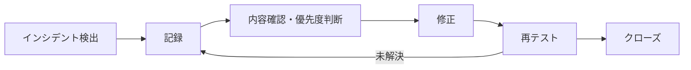
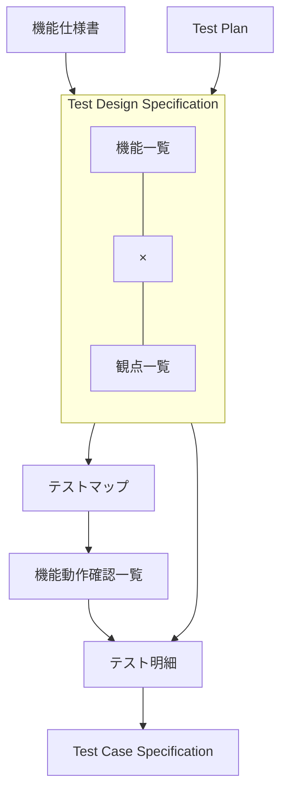
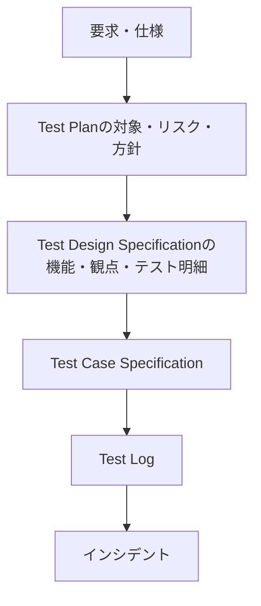

# テスト文書作成ガイドライン

## 目次

1. [概要](#1-概要)
2. [テスト文書の関係](#2-テスト文書の関係)
3. [Test Plan](#3-test-plan)
4. [Test Design Specification](#4-test-design-specification)
5. [Test Case Specification](#5-test-case-specification)
6. [文書間の整合性](#6-文書間の整合性)
7. [レビュー](#7-レビュー)
8. [テンプレート](#8-テンプレート)

---

## 1. 概要

本書は、Test Plan、Test Design Specification、Test Case Specification の作成方法を定義する。

テストで何を対象にし、どのようなテストケースを選び、何を検証するかは、[テストガイドライン](../software/testing-guidelines.md)に従う。

本書では、その内容をテスト計画、テスト設計、テストケースへ段階的に落とし込み、関係者が同じ前提でテストを準備、実行、レビューできる状態にする方法を定める。

テスト文書には、実行前に決める仕様と、実行後に得られる記録を混在させない。

| 文書 | 主な役割 | 実行前に定義する内容 |
| --- | --- | --- |
| Test Plan | テスト全体の方針を定める。 | 目的、範囲、リスク、アプローチ、日程、判定基準、環境、データ、体制。 |
| Test Design Specification | Test Planを具体的なテスト設計へ展開する。 | テスト対象の分解、テスト観点、テストマップ、機能動作確認、テスト明細。 |
| Test Case Specification | 実行可能な単位へ落とし込む。 | テスト対象、観点、実行条件、実行手順、期待結果、参照。 |
| Test Log | 実行した事実を記録する。 | Test Case Specificationには含めない。 |

---

## 2. テスト文書の関係

テスト文書は、上位の判断を下位の具体的な検証へ落とし込む。

Test Planで定めたテスト対象、重要度、リスク、テストタイプ、テスト技法、完了基準は、Test Design Specificationの判断根拠として使う。

Test Design Specificationで抽出した機能、観点、条件、パラメータは、Test Case Specificationへ引き継ぐ。

Test Case Specificationに記載した期待結果は、要求、仕様、設計のいずれかへ追跡できるようにする。

Test Logは、Test Case Specificationを変更せず、実際にいつ、誰が、どの環境で実行し、どの結果になったかを記録する。

---

## 3. Test Plan

### 3.1 目的

Test Planは、テスト全体で何を達成し、何を対象とし、どのような方針、条件、体制、日程で実施するかを定める。

Test Planだけを読めば、少なくとも次の問いに答えられる状態にする。

- なぜこのテストを行うのか。
- 何を対象とし、何を対象外とするのか。
- どのリスクを重視するのか。
- どのテストレベル、テストタイプ、テスト技法を使うのか。
- いつ開始し、どの条件で終了または完了とするのか。
- どの環境とデータが必要か。
- 誰が責任を持ち、誰とどのように連携するのか。
- どの成果物をいつ作成するのか。

### 3.2 表紙情報

表紙には、対象と文書を一意に識別できる情報を記載する。

| 項目 | 記載内容 |
| --- | --- |
| テスト対象システム名 | テスト対象となるシステム、製品、サービスの名称。 |
| テストレベル／テストタイプ | 結合、システム、受入などのテストレベルと、機能、性能などのテストタイプ。 |
| ドキュメント識別番号 | プロジェクト内で文書を一意に識別する番号。 |
| Ver. | 文書のバージョン。 |
| 作成年月日 | 文書を作成した日付。 |
| 発行組織 | 文書を発行する組織。 |
| 作成者氏名 | 文書の作成者。 |

ドキュメント識別番号は、プロジェクト内の文書体系に合わせて決定する。

### 3.3 改訂履歴

改訂履歴では、いつ、誰が、何を、なぜ変更し、誰が承認したかを追跡できるようにする。

本文の内容に影響する変更を行った場合は、改訂履歴も更新する。

### 3.4 本書の対象

対象ユーザー、システム目的、システム詳細、開発分類および内容を記載し、どの製品、どの開発、どの利用者を前提にしたテスト計画なのかを明確にする。

説明は、テストスコープを判断できる具体性を持たせる。

### 3.5 リファレンスとテストベース

テスト計画、テスト設計、期待結果の根拠にする文書を列挙する。

対象になる資料には、次のようなものがある。

- 要求仕様書。
- 機能仕様書。
- UI仕様書。
- API仕様書。
- 設計書。
- リスク一覧。
- 障害履歴。
- 過去のテスト結果。
- 運用手順。
- 関連する規格や契約上の要求。

資料名称だけでなく、必要に応じて作成者、バージョン、受領日、保存場所を記載する。

テストケースの期待結果を決めるときに、どの資料を正とするのか判断できる状態にする。

### 3.6 テストの背景

現在の状況と、テストを必要とする問題点または懸念事項を記載する。

単に「品質を確認する」のような一般論を書かず、このテストが必要になった背景を記載する。

例:

- 大規模な認証方式の変更を行ったため、既存ログイン経路への影響を確認する。
- 障害が集中している機能を改修したため、再発と周辺影響を重点的に確認する。
- 新しいOSをサポート対象へ追加したため、互換性を確認する。

### 3.7 テストの目的と目標

目的には、テストを行う理由を端的に記載する。

目標には、目的を達成したと判断するための具体的な到達点を記載する。

目的をテストアイテムそのものの説明にしない。

目的が複数ある場合は、目的ごとに分けて記載する。

例:

| 項目 | 例 |
| --- | --- |
| テストの目的 | 認証方式変更後も、既存利用者が要求どおりログインできることを確認する。 |
| テストの目標 | 対象範囲のテストケースを完了し、未解決の重大インシデントがない状態にする。 |

### 3.8 対象テストレベル

このTest Planが対象とするテストレベルを明記する。

複数のテストレベルを一つの計画で扱う場合は、それぞれの役割と境界を区別する。

### 3.9 プロジェクト全体の状況

要件定義、設計、実装、各テストレベルの進捗を記載する。

テスト開始に影響する工程の遅延や未完了事項がある場合は、特記事項へ記載する。

### 3.10 具体的な改修内容

派生開発、バージョンアップ、機能追加、置換などの場合は、今回の変更点を列挙する。

変更されていない既存機能も影響を受ける場合は、その影響範囲をテストスコープへ反映する。

### 3.11 テストアイテム

テスト対象となる製品、モジュール、サービス、サブシステム、外部インターフェースなどを識別する。

対象が多い場合は、別資料に一覧を置き、Test Planから参照してよい。

### 3.12 テストタイプ

実施するテストタイプを選択し、その目的を明確にする。

テンプレートにあるテストタイプは例であり、プロジェクトで必要なものへ調整する。

| テストタイプ | 確認する内容 |
| --- | --- |
| 機能テスト | 機能が仕様どおりの結果を返すか。 |
| シナリオテスト | 利用者の一連の操作が成立するか。 |
| 性能テスト | 応答時間、処理時間、スループットなどが要求を満たすか。 |
| ロードテスト | 想定する負荷で要求どおり動作するか。 |
| ストレステスト | 限界付近または限界を超える条件での挙動。 |
| ユーザビリティテスト | 理解しやすさ、操作しやすさなどの要求。 |
| ローカライゼーションテスト | 言語、地域設定、文字、日時、通貨などの地域差。 |
| 保守性テスト | 保守に関する要求を確認できる場合の検証。 |
| 信頼性テスト | 指定した期間、回数、条件で安定して動作するか。 |
| 移植性テスト | 対象環境間での動作や移行に関する要求。 |

### 3.13 テスト作業全体の流れと成果物

テスト計画、テスト設計・実装、テスト実行、テスト終結の流れと、各段階で作成する中間生成物、成果物を整理する。

中間生成物には、機能一覧、観点一覧、テストマップ、テスト明細、テストデータ設計などを含められる。

成果物には、Test Plan、Test Design Specification、Test Case Specification、Test Log、テスト完了時の報告書などを含められる。

中間生成物は、テスト内容に応じて必要なものを選ぶ。

### 3.14 テスト対象範囲

対象機能と非対象機能を分けて記載する。

「システム全体」のような曖昧な範囲だけで済ませず、機能、サブシステム、画面、API、データ、外部連携など、テスト設計へ展開できる単位で示す。

非対象にするものは、対象外とする理由を必要に応じて記載する。

対象外の機能が対象機能へ影響する可能性がある場合は、その前提を記載する。

### 3.15 プロダクトリスク

製品の品質に関するリスクと、その低減方法を整理する。

リスクは、テストの優先順位、重要度、テスト技法、テスト量へ反映する。

リスクを評価するときは、少なくとも次を検討する。

- 故障が発生する可能性。
- 故障した場合の利用者、業務、データ、セキュリティへの影響。
- 変更量。
- 技術的な複雑さ。
- 過去の障害実績。
- 検証しにくさ。
- 外部依存の多さ。

リスク評価の尺度を使用する場合は、尺度の意味を定義する。

### 3.16 各機能における観点

機能とテスト観点を対応付け、どの機能をどの観点で確認するかを整理する。

この段階では、個々のテストケースまで具体化せず、テスト設計の方向を決める。

### 3.17 テストアイテム、観点、機能の重要度

重要度は、プロダクトリスク、利用頻度、影響範囲、変更量などの根拠に基づいて決定する。

重要度をA、B、Cなどで表す場合は、各値の意味を明確にする。

例:

| 重要度 | 意味 |
| --- | --- |
| A | 重点的に検証する。欠陥時の影響が大きい、または変更リスクが高い。 |
| B | 標準的な深さで検証する。 |
| C | 最低限の確認を行う。 |

重要度だけを記載せず、設定理由を残す。

### 3.18 テストに用いる技法

テストタイプまたはテスト対象ごとに、使用するテスト設計技法を選ぶ。

使用する技法の例は、次のとおり。

- 同値分割。
- 境界値分析。
- デシジョンテーブル。
- 状態遷移。
- シナリオベース。
- 組合せテスト。
- エラー推測。

どの技法を選ぶかは、入力、状態、条件の組合せ、リスク、要求されたカバレッジに基づいて決定する。

技法を使ったこと自体を目的にせず、必要なテスト条件を漏れなく抽出するために使う。

### 3.19 テスト期間

仕様理解、テスト計画、テスト設計、テスト実装、テスト実行、テスト終結の予定期間と工数を記載する。

開始条件を満たす前に実行開始する計画になっていないかを確認する。

### 3.20 スケジュール

作業期間だけでなく、次の関係が分かるようにする。

- 各テストアクティビティの開始と終了。
- Test Plan、テストマップ、テスト明細、Test Case Specificationなどの作成時期。
- 環境構築とテストデータ準備。
- テスト開始、完了、報告提出などのマイルストーン。
- 依存する開発工程または成果物。

リスクが高いアクティビティを先に実施する場合は、スケジュールへ反映する。

### 3.21 成果物

成果物ごとに、成果物名、概要、納期を記載する。

同じ内容を別形式で重複して管理しない。

中間生成物と正式な成果物の扱いが異なる場合は区別する。

### 3.22 見積

Test Planに基づく工数、費用、要員などの見積資料が別に存在する場合は、その資料を識別できるようにする。

見積の前提がTest Planのスコープ、環境、体制、日程と一致していることを確認する。

### 3.23 テスト開始基準と終了基準

開始基準は、テストを開始してよい条件を定義する。

例:

- 対象ビルドが指定環境へ配備済みである。
- 必要なテストデータが準備済みである。
- テスト対象範囲の仕様がレビュー済みである。
- テスト環境が利用可能である。
- 重大な開始阻害事項が解消されている。

終了基準は、そのテスト活動を終了してよい条件を定義する。

開始基準と完了基準を混同しない。

### 3.24 テスト中断基準と再開基準

中断基準には、テストを継続しても有効な結果が得られない状態を定義する。

例:

- テスト環境が利用できない。
- 対象ビルドが基本操作を実行できない。
- 重大な仕様不明点により、多数のケースの期待結果を判定できない。
- テストデータが破損し、再利用できない。

再開基準には、中断理由がどの状態まで解消されたら再開できるかを記載する。

「都度判断する」だけで済ませず、判断者と判断材料を定義する。

### 3.25 テスト完了基準

テスト活動を完了したと判断する条件を定義する。

例:

- 実施対象のテストケースが完了している。
- 未実施ケースがある場合、その理由と影響が承認されている。
- 重大度の高い未解決インシデントがない。
- 必要な再テストとリグレッションテストが完了している。
- 必要なテストログと証跡が揃っている。
- 終結時の報告に必要なメトリクスが収集済みである。

「テストケースを100%実施した」のような実施率だけを、品質が十分である根拠にしない。

### 3.26 再テストとリグレッションテスト

再テストは、修正された不具合が解消されたことを確認するために実施する。

リグレッションテストは、変更によって既存機能へ望まない影響が生じていないことを確認するために実施する。

実施条件には、変更範囲、影響範囲、リスク、修正内容を使う。

### 3.27 テスト実施結果の判定基準

各ステータスの意味をプロジェクト内で一意にする。

例:

| ステータス | 意味 |
| --- | --- |
| OK | 期待結果を満たした。 |
| NG | 期待結果を満たさず、インシデントとして扱う。 |
| QA | 仕様または期待結果を確定できず、確認中である。 |
| NT | 計画変更などにより、実施対象から外した。 |
| N/A | 対象条件が成立せず、実施できない。 |
| 保留 | 現時点では実施できないが、条件が整えば実施する。 |

同じ状態を複数のステータスで表現しない。

### 3.28 インシデント判定基準

インシデントのランクを決めるときは、再現頻度だけでなく、利用者への影響、回避可否、データ損失、業務停止、安全性、セキュリティなどを考慮する。

ランク名をA、B、C、Dなどで表す場合は、各ランクの意味を明記する。

### 3.29 質問事項の重要度

質問がテスト進捗、判定、対象範囲へ与える影響に基づいて重要度を決める。

件数を基準に使う場合は、プロジェクトに合った具体的な閾値へ置き換える。

### 3.30 テスト実行時の記録

Test Logには、少なくとも次を記録する。

- テスト実施日。
- テスト実施者。
- テスト実行環境。
- 対象バージョン。
- 判定結果。
- インシデントの管理ID。
- 必要な証跡。
- 再テスト結果。

Test Case Specificationへ実行結果を書き込んで仕様と記録を混在させない。

### 3.31 収集するメトリクス

メトリクスは、テストの状況、リスク、品質傾向を判断するために収集する。

収集する候補には次がある。

- テスト実施件数。
- 未実施件数。
- インシデント件数。
- 未解決インシデント件数。
- 機能別インシデント件数。
- テスト実施時間。
- 再テスト件数。
- テスト対象ごとの結果分布。

率を使う場合は、分子と分母を明記する。

集計値だけで品質を断定せず、対象範囲、リスク、未実施理由と合わせて評価する。

### 3.32 テスト環境要件

テスト結果へ影響する環境条件を記載する。

例:

- OS、ブラウザ、ランタイム。
- サーバー、データベース、ミドルウェア。
- スマートフォン、PC、周辺機器。
- ネットワーク条件。
- 外部サービス。
- ファームウェア。
- 構成値。
- 提供元と利用可能期間。

比較対象機を使用する場合は、目的と対象機を明確にする。

### 3.33 テストデータ要件

テストデータごとに、説明、責任部門、利用期間、リセット方法、アーカイブ要否を定義する。

個人情報、機密情報、本番データを使う場合は、利用可否、匿名化、保管、削除のルールも確認する。

データを初期状態へ戻す必要がある場合は、誰が、どのタイミングで、どの状態へ復元するかを定義する。

### 3.34 コミュニケーションと定期報告

質問、進捗報告、インシデント報告、緊急連絡について、手段とタイミングを定義する。

特定の製品名に依存せず、プロジェクトで採用している課題管理ツール、チャット、メール、会議などを記載する。

緊急度が高い事項は、通常の進捗報告とは別の経路を定義する。

### 3.35 インシデントの報告と運用

インシデント検出から、起票、優先度判断、担当決定、修正、再テスト、クローズまでの流れを定義する。

必要に応じてMermaidで表現する。

### 3.36 テスト体制とステークホルダー

役割ごとの責任を明確にする。

例:

| 役割 | 主な責任 |
| --- | --- |
| 開発PM | 開発全体の意思決定と調整。 |
| 開発リーダー | 開発側の技術判断、修正計画。 |
| テストチームリーダー | テスト活動全体の管理。 |
| テスト設計担当 | テスト分析、設計、ケース作成。 |
| テスト実施担当 | Test Case Specificationに従った実行と記録。 |

同じ役割名でもプロジェクトごとに責任が異なる場合は、責任内容を明記する。

### 3.37 採用ニーズ

テストを実施するために必要な人数、役割、スキルを記載する。

追加要員が必要な場合は、必要時期と必要スキルを記載する。

### 3.38 トレーニング

対象システム、業務知識、テスト技法、テスト管理方法などについて事前教育が必要な場合は、対象者、内容、実施時期を記載する。

### 3.39 テスト実施者の独立性

開発担当者とテスト設計者または実施者の関係を記載する。

独立したレビューや別担当者による検証が必要な場合は、その範囲と理由を明確にする。

### 3.40 予見できるリスクと対応方針

テスト活動そのものを妨げるリスクを記載する。

例:

- 仕様確定の遅延。
- 開発遅延。
- テスト環境の準備遅延。
- 外部サービスの利用不可。
- 必要要員の不足。
- テストデータの準備不足。
- 重大な不具合による後続テスト停止。

各リスクには、発生時の対応方針を記載する。

### 3.41 プロジェクトリスク

スケジュール、予算、要員、依存先など、プロジェクト成果へ影響するリスクをTest Planから追跡できるようにする。

別のリスク登録表を使う場合は、その識別子またはリポジトリ内の参照先を記載する。

### 3.42 前提条件と制約事項

前提条件には、計画が成立するために必要な条件を記載する。

制約事項には、変更できない期限、利用可能な環境、予算、要員、ツール、契約上の条件などを記載する。

「必要に応じて」のように判断基準を曖昧にせず、分かっている条件は具体的に書く。

### 3.43 用語集と参考文献

プロジェクト固有の用語、略語、頭字語を定義する。

参考文献には、本文の判断根拠にした要求、仕様、設計、標準、社内文書などを記載する。

### 3.44 特記事項

他の章へ分類できないが、テスト計画の理解や実行に必要な事項だけを記載する。

他の章と同じ内容を重複して書かない。

---

## 4. Test Design Specification

### 4.1 目的

Test Design Specificationは、Test Planで定めたテスト対象、テスト観点、重要度、リスク、テスト技法を、テストケースを作成できる粒度まで具体化する。

Test Planの内容を再記載するのではなく、Test Planを入力として設計判断を展開する。

### 4.2 適用範囲

Test Planのうち、このTest Design Specificationで設計する対象を明確にする。

テストレベル、テストタイプ、対象機能などを区切って複数のTest Design Specificationを作る場合は、それぞれの境界が重複または欠落しないようにする。

### 4.3 参考文献

テスト設計で使用する要求、機能仕様、設計、リスク情報を列挙する。

テストケースの期待結果を判断する根拠へ追跡できるよう、文書識別番号またはリポジトリ内の参照先を使う。

### 4.4 テスト設計の流れ

テスト設計は、次の順序で行う。

1. テスト対象項目を細分化する。
2. テスト観点を細分化する。
3. テスト対象と観点をマトリクス化する。
4. 機能ごとに必要な確認内容を洗い出す。
5. テスト明細を作成する。
6. テストケースを作成する。

### 4.5 テスト対象機能の細分化

Test Planに記載した対象を、テスト設計で扱える粒度まで分解する。

機能一覧には、少なくとも次を記載する。

| 項目 | 記載内容 |
| --- | --- |
| 機能No | 機能を一意に識別する番号。 |
| 大項目 | 機能領域や大分類。 |
| 中項目 | 大項目を構成する機能。 |
| 小項目 | テスト設計上、独立して扱う最小の機能単位。 |
| 重要度 | Test Planのリスク、重要度を反映した値。 |
| 備考 | 前提、例外、補足。 |

画面の見た目だけで分解せず、要求または機能の責務が追跡できる単位にする。

### 4.6 テスト観点の細分化

Test Planにあるテスト観点を、具体的な確認内容へ展開する。

観点一覧には、次を記載する。

| 項目 | 記載内容 |
| --- | --- |
| No | 観点を識別する番号。 |
| 大分類 | 品質特性、テストタイプ、検証の大きな観点。 |
| 中分類 | 大分類を分解した観点。 |
| 小分類 | テストケースへ展開できる具体的な観点。 |
| 確認内容 | その観点で何を確認するか。 |

「入力チェック」「正常系」のような抽象名だけで済ませず、何を確認する観点なのかを説明できる状態にする。

### 4.7 テストマップ

機能一覧と観点一覧を組み合わせ、どの機能をどの観点で確認するかを決定する。

各交点では、少なくとも次を判断する。

- テスト対象とするか。
- 対象外とする場合、その理由は何か。
- 重要度はどの程度か。
- リスクに対して十分な確認になっているか。

全組合せを機械的にテスト対象にせず、意味のある組合せを選ぶ。

対象外にした組合せが後から問題にならないよう、判断根拠を残す。

### 4.8 機能動作確認一覧

機能ごとに、その機能が果たすべき要求と、要求を確認するための内容を整理する。

| 項目 | 記載内容 |
| --- | --- |
| 大項目 | 機能一覧の大分類。 |
| 中項目 | 機能一覧の中分類。 |
| 小項目 | 機能一覧の小分類。 |
| 機能要件 | 機能が満たすべき要求。 |
| 確認内容 | 要求を満たしたと判断するために確認する内容。 |

確認内容は、実装の内部手順ではなく、外部から確認できる振る舞いを基準にする。

### 4.9 テスト明細

テスト対象となる機能と観点の組合せについて、テストケース作成前の具体的な条件を整理する。

グループ項目には、テストセット全体で共通する情報を記載する。

| 項目 | 記載内容 |
| --- | --- |
| テスト対象1 | 対象システム。 |
| テスト対象2 | 対象システム内の要素。 |
| テストタイプ | 該当テストの分類。 |
| 機能大項目 | 機能一覧の大分類。 |

個別項目には、テストセットごとに異なる情報を記載する。

| 項目 | 記載内容 |
| --- | --- |
| テストセットID | テストセットを一意に識別するID。 |
| 機能中項目 | 機能一覧の中分類。 |
| 機能小項目 | 機能一覧の小分類。 |
| セット内容 | このテストセットで確認する内容。 |
| テスト観点 | テストマップで選択した観点。 |
| 確認内容 | 観点一覧を基に具体化した確認内容。 |
| テストパラメータ | 入力値、状態、権限、データなどの条件パターン。 |
| 件数 | 必要になるテストケース数の見込み。 |

テストパラメータは、同値分割、境界値、条件の組合せ、状態遷移などを使って抽出する。

### 4.10 テストケースへの展開

テスト明細を、実行者が迷わず実行でき、期待結果を一意に判定できる単位へ分割する。

一つのケースへ複数の独立した目的を詰め込みすぎない。

同じ前提条件を複数のケースで使う場合は共通化してよいが、依存関係がある場合は明示する。

Test Case Specificationへ引き継ぐ情報は、次のとおり。

- テストケースNo.
- テスト対象。
- テスト観点。
- 実行条件。
- 実行手順。
- 期待結果。
- 参照。

結果判定、実行日、実行者、実行環境、不具合IDは実行結果であるため、Test Case SpecificationではなくTest Logへ記録する。

### 4.11 特記事項

テスト設計の前提、対象外とした理由、他の設計書との分担など、このTest Design Specificationを理解するために必要な情報を記載する。

Test Planと同じ説明を重複して記載しない。

### 4.12 変更時の扱い

要求、仕様、Test Plan、リスク、対象範囲が変わった場合は、影響する機能一覧、観点一覧、テストマップ、テスト明細、Test Case Specificationを確認する。

変更された箇所だけでなく、関連するテストケースが古い前提を保持していないかを確認する。

---

## 5. Test Case Specification

### 5.1 目的

Test Case Specificationは、テスト実行前に「何を、どの条件で、どの手順により確認し、何をもって合格とするか」を定義する。

実行者が変わっても、同じ前提、同じ操作、同じ判定基準で実施できる粒度にする。

Test Case Specificationは実行記録ではない。

### 5.2 テストケースNo.

各テストケースを一意に識別できるIDを付ける。

IDは、要求、テスト明細、インシデント、Test Logから参照できるようにする。

採番規則を設ける場合は、プロジェクト内で一貫した形式にする。

例:

`TC-AUTH-001`

枝番を使って期待結果を分割する場合は、枝番の意味を統一する。

### 5.3 テスト対象

ソフトウェアのどの部分を確認するかを記載する。

対象が複雑な場合は、大項目、中項目、小項目へ分解する。

例:

| 大項目 | 中項目 | 小項目 |
| --- | --- | --- |
| アカウント管理 | ログイン | パスワード入力 |

機能一覧と異なる独自分類を作る場合は、対応関係を追跡できるようにする。

### 5.4 テスト観点

そのケースで何を確認するのかを端的に記載する。

操作名ではなく、テストケースを作成した意図が分かる表現にする。

悪い例:

`入力チェック`

良い例:

`パスワード未入力時に認証を開始できないこと`

観点だけを読んでも、正常系、異常系、境界、権限、状態など、何を確認しようとしているか判断できるようにする。

### 5.5 実行条件

テスト開始前に成立している必要がある条件を記載する。

対象には次を含められる。

- テストデータ。
- アカウント。
- 権限。
- ログイン状態。
- 対象バージョン。
- デバイス。
- OS。
- ブラウザ。
- 設定値。
- 外部サービスの状態。
- 入力値。
- 前提となる状態。

実行条件と実行手順を混在させない。

例:

- 有効な一般ユーザーが登録済みである。
- 対象ユーザーはログアウト状態である。
- ユーザー名は`test-user`を使用する。
- パスワードは空文字とする。

### 5.6 実行手順

実行者が追加の解釈をしなくても操作できる具体性で、順序どおりに記載する。

必要に応じて、次を含める。

- 画面名。
- ボタン名。
- 入力項目名。
- API。
- HTTPメソッド。
- URLまたはリポジトリ内のエンドポイント識別子。
- コマンド。
- 入力値。
- 操作順序。

例:

1. ログイン画面を開く。
2. ユーザー名に`test-user`を入力する。
3. パスワードは入力しない。
4. ログインを実行する。

「通常どおり操作する」「適切な値を入力する」のように、実行者の判断へ委ねる表現を使わない。

### 5.7 期待結果

どの挙動、値、状態、表示であれば合格と判断できるかを具体的に記載する。

悪い例:

- 正常に動作する。
- 正しく表示される。
- 問題ないこと。

良い例:

- 認証要求が送信されない。
- パスワード入力欄の近傍に必須入力エラーが表示される。
- ログイン後画面へ遷移しない。

期待結果は、実装の内部処理ではなく、要求された外部から観測可能な結果を優先する。

複数の独立した期待結果があり、一部だけ成功または失敗する可能性がある場合は、ケースまたは判定単位を分ける。

### 5.8 参照とトレーサビリティ

テストケースから、根拠となる要求、仕様、設計、テスト明細へ追跡できるようにする。

参照には、文書名だけでなく、一意な識別子またはリポジトリ内の安定したパスを使う。

例:

`REQ-AUTH-003`

`docs/authentication.md#password-required`

Test Case Specificationから要求へたどれるだけでなく、要求から関連するテストケースを検索できる状態が望ましい。

### 5.9 ケースの粒度

一つのテストケースでは、一つの主要な判定目的を扱う。

独立して失敗し得る複数の期待結果を、一つの巨大なケースへ詰め込まない。

ただし、利用者の一連の操作そのものを検証するシナリオテストでは、複数の操作を一つのケースとして扱ってよい。

粒度は、失敗時に原因と影響を特定できることを基準に決める。

### 5.10 テストデータ

入力値は、テスト観点とテスト設計技法に基づいて選ぶ。

単にランダムな値を並べず、その値を選んだ理由が説明できるようにする。

例:

- 有効範囲の代表値。
- 境界値。
- 境界の直前と直後。
- 無効な値。
- 空文字。
- `null`相当。
- 最大長。
- 最大長を超える値。
- 特定の状態でだけ意味が変わる値。

大量のテストデータを別ファイルで管理する場合は、Test Case Specificationから参照できるようにする。

### 5.11 ケース間の依存

ケースAの実行結果を前提としてケースBを実行する設計は、失敗が連鎖しやすい。

可能な限り、各ケースは必要な前提状態を自分で準備できるようにする。

依存が避けられない場合は、依存先のケースIDと必要な状態を明記する。

### 5.12 共通手順と共通条件

同じ前提条件や操作が多数のケースで重複する場合は、共通手順または共通条件として再利用してよい。

ただし、共通化した結果、単独のテストケースだけでは実行方法を理解できなくならないようにする。

参照先は、同じリポジトリ内で安定して識別できるものにする。

### 5.13 結果とログの分離

次の項目はテスト実行で発生する記録であり、Test Case SpecificationではなくTest Logまたはテスト管理ツールで管理する。

- 結果判定。
- 実行日時。
- 実行者。
- 実行環境。
- 対象バージョン。
- 不具合ID。
- 証跡。
- 実行時の備考。
- 再テスト結果。

OK件数、NG件数、進捗率などの集計値もTest Case Specificationへ保持しない。

集計値はTest Logまたはテスト管理ツールの実行記録から算出する。

### 5.14 作成規則

テストケースを作成するときは、次を守る。

1. 実行者によって解釈が変わる表現を避ける。
2. テスト観点から作成意図を読み取れるようにする。
3. 前提条件、操作、期待結果を分離する。
4. 要求、仕様、設計、テスト明細とのトレーサビリティを確保する。
5. 一つのケースの責務を必要以上に広げない。
6. 独立して判定したい期待結果は分割する。
7. 共通条件を再利用する場合は参照先を明確にする。
8. ケース間に依存がある場合は依存関係を明記する。
9. 実装の内部構造を確認すること自体を目的にせず、要求された振る舞いを検証する。
10. 境界、異常、権限、状態遷移など、対象の特性に応じた条件を漏らさない。

### 5.15 記載例

次は一つのテストケースの例である。

| 項目 | 内容 |
| --- | --- |
| テストケースNo. | `TC-AUTH-001` |
| テスト対象（大項目） | アカウント管理 |
| テスト対象（中項目） | ログイン |
| テスト対象（小項目） | パスワード入力 |
| テスト観点 | パスワード未入力時に認証を開始できないこと |
| 実行条件 | 有効な一般ユーザー`test-user`が登録済みで、ログアウト状態である。 |
| 実行手順 | 1. ログイン画面を開く。 2. ユーザー名に`test-user`を入力する。 3. パスワードを空欄のままにする。 4. ログインを実行する。 |
| 期待結果 | 認証要求が送信されず、パスワード入力欄の近傍に必須入力エラーが表示され、ログイン後画面へ遷移しない。 |
| 参照 | `REQ-AUTH-003` |

---

## 6. 文書間の整合性

### 6.1 用語を統一する

Test Plan、Test Design Specification、Test Case Specificationで、同じ機能、観点、テストタイプを別名で表現しない。

名称を変更した場合は、関連文書も更新する。

### 6.2 上位文書から追跡できるようにする

少なくとも次の追跡関係を維持する。

### 6.3 対象範囲の欠落を確認する

Test Planで対象とした機能が、Test Design Specificationで理由なく消えていないことを確認する。

Test Design Specificationでテスト対象とした機能と観点が、Test Case Specificationへ必要な範囲で展開されていることを確認する。

### 6.4 対象外の根拠を残す

テストしない機能、観点、組合せがある場合は、なぜ対象外としたかを説明できるようにする。

「時間がないため」だけで済ませず、リスクと影響を確認する。

### 6.5 変更を伝播する

要求または仕様が変わった場合は、次を順に確認する。

1. Test Planの対象、リスク、方針、日程、基準への影響。
2. Test Design Specificationの機能、観点、テストマップ、明細への影響。
3. Test Case Specificationの条件、手順、期待結果への影響。
4. 既存のTest Logやインシデントの扱いへの影響。

---

## 7. レビュー

### 7.1 Test Plan

- テストの背景、目的、目標が区別されている。
- 対象と非対象が判断できる。
- テストベースが識別できる。
- プロダクトリスクがテストの重要度へ反映されている。
- テストタイプとテスト技法の選定理由を説明できる。
- 開始、終了、中断、再開、完了の基準が具体的である。
- スケジュールとマイルストーンの関係が分かる。
- 必要な環境、データ、要員が定義されている。
- 役割と連絡方法が分かる。
- テスト活動を阻害するリスクと対応方針がある。
- 前提条件と制約事項が矛盾していない。

### 7.2 Test Design Specification

- Test Planの対象範囲と一致している。
- 機能一覧の粒度がテスト設計に適している。
- 観点一覧が具体的な確認内容まで分解されている。
- 機能と観点の組合せに欠落または不要な重複がない。
- 重要度と対象外判断に根拠がある。
- テスト明細のパラメータからテストケースを作成できる。
- 期待結果の根拠になる要求または仕様へ追跡できる。

### 7.3 Test Case Specification

- テストケースNo.が一意である。
- テスト対象が識別できる。
- テスト観点から作成意図が分かる。
- 実行条件と実行手順が分離されている。
- 実行手順に曖昧な操作がない。
- 期待結果が観測可能で、一意に判定できる。
- 要求、仕様、設計、テスト明細へ追跡できる。
- 一つのケースへ独立した目的を詰め込みすぎていない。
- 実行結果、実行者、不具合ID、進捗率などが仕様へ混在していない。

---

## 8. テンプレート

文書を作成するときは、次のテンプレートを使う。

- [Test Plan](../../templates/documentation/test-plan.md)
- [Test Design Specification](../../templates/documentation/test-design-specification.md)
- [Test Case Specification](../../templates/documentation/test-case-specification.md)
