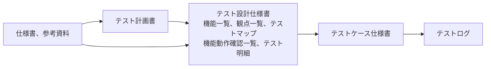

# テスト文書ガイドライン

## 目次

1. [概要](#1-概要)
2. [準拠する規格](#2-準拠する規格)
3. [テスト文書の種類](#3-テスト文書の種類)
4. [テスト計画書](#4-テスト計画書)
5. [テスト設計仕様書](#5-テスト設計仕様書)
6. [テストケース仕様書](#6-テストケース仕様書)
7. [実行結果の記録](#7-実行結果の記録)
8. [参考資料](#8-参考資料)

---

## 1. 概要

本書は、ISO/IEC/IEEE 29119に準拠して、テスト計画書、テスト設計仕様書、テストケース仕様書を作成する方法と、各文書とISO/IEC/IEEE 29119-3:2021が定めるテスト文書との対応を定める。

テストの対象は、ソフトウェアに限らず、システム、ハードウェアを含むシステム、要求仕様書や利用者向けの手引きのような文書でもよい。どのテストケースを選び、何を検証するかは[テストガイドライン](../software/testing-guidelines.md)に従う。

---

## 2. 準拠する規格

テスト文書は、ISO/IEC/IEEE 29119に準拠して作成する。同規格は、テストプロセスが作成するテスト文書の種類と、各文書に書く情報項目を定める。

| 規格 | 本書での使い方 |
| --- | --- |
| ISO/IEC/IEEE 29119-3:2021 | テスト文書の種類と情報項目を確認し、テンプレートとの対応を示す。 |
| ISO/IEC/IEEE 29119-2:2021 | どのテストプロセスがどの文書を作成し、使用するかを確認する。 |
| ISO/IEC/IEEE 29119-4:2021 | テストモデルの作成、テストカバレッジ項目の特定、テストケースの導出に使うテスト設計技法を確認する。 |

テスト設計仕様書（Test design specification）は、2013年の初版が定めていた文書の名称である。2021年の第2版は、テスト条件（test condition）をテストモデル（test model）に置き換え、テスト設計仕様書に代えてテストモデル仕様書（Test model specification）を定める。IEEE 829-2008はISO/IEC/IEEE 29119-3に置き換えられている。

---

## 3. テスト文書の種類

### 規格が定める文書の一覧

ISO/IEC/IEEE 29119-3:2021は、テストプロセスの階層ごとに次の文書を定める。「対応するテンプレート」は、その文書の情報を記載するテンプレートと章を示す。

| 階層 | 文書 | 規格の箇条 | 内容 | 対応するテンプレート |
| --- | --- | --- | --- | --- |
| 組織 | Test policy（テスト方針） | 6.2 | 組織におけるテストの目的、目標、原則、範囲を示す。 | なし |
| 組織 | Organizational test practices（組織のテスト実践） | 6.3 | 組織の中でテストをどう行うかを、推奨する方法として示す。 | なし |
| テストマネジメント | Test plan（テスト計画書） | 7.2 | テストの目的と、それを達成する手段と日程を示す。テスト戦略を含む。 | Test Plan |
| テストマネジメント | Test status report（テスト状況報告書） | 7.3 | 報告期間ごとのテストの状況を示す。 | なし |
| テストマネジメント | Test completion report（テスト完了報告書） | 7.4 | 実施したテストの結果をまとめる。 | なし |
| 動的テスト | Test model specification（テストモデル仕様書） | 8.2 | テストで焦点を当てる特性や品質を表すテストモデルを定める。 | Test Design Specification |
| 動的テスト | Test case specification（テストケース仕様書） | 8.3 | テストカバレッジ項目とテストケースを定める。 | Test Design Specification（テスト明細） Test Case Specification |
| 動的テスト | Test procedure specification（テスト手順仕様書） | 8.4 | テストケースを実行順に並べたテスト手順を定める。 | Test Case Specification（実行手順） |
| 動的テスト | Test data requirements（テストデータ要求） | 8.5 | テストデータに必要な性質を定める。 | Test Plan（12.2 テストデータ要件） |
| 動的テスト | Test environment requirements（テスト環境要求） | 8.6 | テスト環境に必要な性質を定める。 | Test Plan（12.1 テスト環境要件） |
| 動的テスト | Test data readiness report（テストデータ準備状況報告書） | 8.7 | テストデータ要求ごとの準備状況を示す。 | なし |
| 動的テスト | Test environment readiness report（テスト環境準備状況報告書） | 8.8 | テスト環境要求ごとの準備状況を示す。 | なし |
| 動的テスト | Actual results and test result（実測結果とテスト結果） | 8.9 | テストケースの実行で観測した結果と、合否を示す。 | テストログ |
| 動的テスト | Test execution log（テスト実行ログ） | 8.10 | テスト手順の実行を記録する。 | テストログ |
| 動的テスト | Incident report（インシデント報告書） | 8.11 | テスト中に発生した事象の内容と状況を示す。 | なし |

### テンプレート

| 文書 | テンプレート | 作成する時点 |
| --- | --- | --- |
| テスト計画書 | [Test Plan](../../templates/documentation/test-plan.md) | テスト計画。テスト設計を始める前に作成する。 |
| テスト設計仕様書 | [Test Design Specification](../../templates/documentation/test-design-specification.md) | テスト設計。テスト計画書のテスト対象と観点を細分化する。 |
| テストケース仕様書 | [Test Case Specification](../../templates/documentation/test-case-specification.md) | テスト実装。テスト明細からテストケースを作成する。 |

### 文書間の導出関係

テスト計画書で定めたテスト対象と観点を、テスト設計仕様書で細分化してテスト明細にまとめ、テスト明細からテストケースを作成する。実行結果はテストログに記録する。

---

## 4. テスト計画書

### 目的

テスト計画書は、テストの目的と、それを達成する手段、体制、日程、判定基準を定め、テスト設計、実装、実行の指針にする。

### 規格の情報項目との対応

ISO/IEC/IEEE 29119-3:2021の付属書Aは、テスト計画書の情報項目の要否を次のように定める。

| 情報項目 | 規格の箇条 | 要否 | テンプレートの記載箇所 |
| --- | --- | --- | --- |
| Context of testing（テストの状況） | 7.2.2 | 必須 | 2. 概要 3. テストの状況 4. プロジェクト全体における位置づけ 6. テストスコープ |
| Assumptions and constraints（前提と制約） | 7.2.3 | 必須 | 15. 前提条件と制限事項 |
| Stakeholders（利害関係者） | 7.2.4 | 必須 | 13.5 ステークホルダー |
| Testing communication（テストのコミュニケーション） | 7.2.5 | 必須 | 13.1 コミュニケーション/定期報告方針 13.2 インシデントの報告および運用の流れ |
| Risk register（リスク登録簿） | 7.2.6 | 必須 | 7. プロダクトリスク 14. 予見できるリスクとその対応方針 |
| Test types（テストタイプ） | 7.2.7.3 | 必須 | 4.5 テストタイプ |
| Test deliverables（テスト成果物） | 7.2.7.4 | 必須 | 5. テスト作業全体の流れと成果物 9.3 成果物 |
| Test design techniques（テスト設計技法） | 7.2.7.5 | 必須 | 8.5 テストに用いる技法 |
| Entry and exit criteria（開始基準と終了基準） | 7.2.7.6 | 必須 | 10.1 テスト開始/終了基準 |
| Test completion criteria（テスト完了基準） | 7.2.7.7 | 必須 | 10.3 テスト完了基準 |
| Degree of independence（独立性の程度） | 7.2.7.8 | 必須 | 13.8 テスト実施者の独立性 |
| Metrics to be collected（収集するメトリクス） | 7.2.7.9 | 必須 | 11. 収集するメトリクス |
| Test data requirements（テストデータ要求） | 7.2.7.10 | 必須 | 12.2 テストデータ要件 |
| Test environment requirements（テスト環境要求） | 7.2.7.11 | 必須 | 12.1 テスト環境要件 |
| Retesting（再テスト） | 7.2.7.12 | 必須 | 10.4 再テスト/リグレッションテスト実施条件 |
| Regression testing（リグレッションテスト） | 7.2.7.13 | 必須 | 10.4 再テスト/リグレッションテスト実施条件 |
| Suspension and resumption criteria（中断基準と再開基準） | 7.2.7.14 | 必須 | 10.2 テスト中断/再開基準 |
| Deviations from the organizational test practices（組織のテスト実践からの逸脱） | 7.2.7.15 | 推奨 | なし |
| Testing activities and estimates（テスト作業と見積り） | 7.2.8 | 必須 | 5. テスト作業全体の流れと成果物 9.1 テスト期間 9.4 見積 |
| Roles and responsibilities（役割と責任） | 7.2.9.2 | 必須 | 13.3 テスト体制 13.5 ステークホルダー |
| Hiring needs（採用の必要性） | 7.2.9.3 | 推奨 | 13.6 採用ニーズ |
| Training needs（トレーニングの必要性） | 7.2.9.4 | 推奨 | 13.7 トレーニングの必要性 |
| Schedule（日程） | 7.2.10 | 必須 | 9.2 スケジュール |

### テスト完了基準は設計技法とあわせて決める

テスト完了基準には、8.5で選んだテスト設計技法ごとに、どこまで網羅すれば完了とするかを書く。テスト設計仕様書とテストケース仕様書は、この基準を満たすようにテスト明細とテストケースを作る。

### 重要度はリスクから決める

8.2から8.4までの重要度は、7章のプロダクトリスクのリスクスコアを反映して決め、決めた理由を「設定理由」に書く。

---

## 5. テスト設計仕様書

### 目的

テスト設計仕様書は、テスト計画書のテスト対象と観点を、テストを設計しやすい単位へ細分化し、テスト明細にまとめてテストケースの基にする。

### 規格の情報項目との対応

テスト設計仕様書の機能一覧、観点一覧、テストマップ、機能動作確認一覧、テスト明細は、規格のテストモデルに当たる。テスト明細のテストパラメータは、規格のテストカバレッジ項目に当たる。

| 規格の文書 | 情報項目 | 規格の箇条 | 要否 | テンプレートの記載箇所 | 対応 |
| --- | --- | --- | --- | --- | --- |
| テストモデル仕様書 | Unique identifier（識別子） | 8.2.2 | 必須 | 文書情報の「ドキュメント識別番号」 | 一部。文書の識別番号はあるが、テストモデルごとの識別子はない。 |
| テストモデル仕様書 | Objective（目的） | 8.2.3 | 必須 | 観点一覧の「確認内容」 | 対応 |
| テストモデル仕様書 | Priority（優先度） | 8.2.4 | 必須 | 機能一覧の「重要度」 テストマップ | 対応 |
| テストモデル仕様書 | Test strategy extract（テスト戦略の抜粋） | 8.2.5 | 必須 | なし | なし。テスト計画書の8.5と10.3を参照する。 |
| テストモデル仕様書 | Test model（テストモデル） | 8.2.6 | 必須 | 機能一覧、観点一覧、テストマップ、機能動作確認一覧、テスト明細 | 対応 |
| テストモデル仕様書 | Traceability（追跡） | 8.2.7 | 必須 | 機能動作確認一覧の「機能要件」 | 一部。機能要件は書くが、要求の識別子を書く欄はない。 |
| テストケース仕様書 | テストカバレッジ項目の Unique identifier（識別子） | 8.3.2.2 | 必須 | テスト明細の「テストセットID」 | 一部。テストセット単位の識別子で、テストパラメータごとの識別子はない。 |
| テストケース仕様書 | テストカバレッジ項目の Description（説明） | 8.3.2.3 | 必須 | テスト明細の「確認内容」「テストパラメータ」 | 対応 |
| テストケース仕様書 | テストカバレッジ項目の Priority（優先度） | 8.3.2.4 | 必須 | なし | なし |
| テストケース仕様書 | テストカバレッジ項目の Traceability（追跡） | 8.3.2.5 | 必須 | テスト明細の「機能中項目」「機能小項目」「テスト観点」 | 対応 |

### 細分化は計画書の分類を引き継ぐ

機能一覧と観点一覧の大分類は、テスト計画書の6.2と8.1の分類をそのまま使う。分類が一致していれば、テスト計画書の重要度とテスト設計仕様書の重要度を突き合わせられる。

### テストパラメータは設計技法で導く

テスト明細のテストパラメータは、テスト計画書の8.5で選んだテスト設計技法を観点ごとに適用して導き、件数はその結果として数える。

---

## 6. テストケース仕様書

### 目的

テストケース仕様書は、テスト明細を基に、実行者が変わっても同じ解釈で実施できる粒度で、条件、手順、期待結果を定める。

### 規格の情報項目との対応

| 規格の文書 | 情報項目 | 規格の箇条 | 要否 | テンプレートの記載箇所 | 対応 |
| --- | --- | --- | --- | --- | --- |
| テストケース仕様書 | Unique identifier（識別子） | 8.3.3.2 | 必須 | テストケースNo. | 対応 |
| テストケース仕様書 | Objective（目的） | 8.3.3.3 | 必須 | テスト観点 | 対応 |
| テストケース仕様書 | Priority（優先度） | 8.3.3.4 | 必須 | なし | なし |
| テストケース仕様書 | Traceability（追跡） | 8.3.3.5 | 必須 | 参照 | 一部。要求や仕様への参照は書くが、テスト明細のテストセットIDを書く欄はない。 |
| テストケース仕様書 | Preconditions（事前条件） | 8.3.3.6 | 必須 | 実行条件 | 対応 |
| テストケース仕様書 | Inputs（入力） | 8.3.3.7 | 必須 | 実行条件の入力値 実行手順 | 対応 |
| テストケース仕様書 | Expected results（期待結果） | 8.3.3.8 | 必須 | 期待結果 | 対応 |
| テスト手順仕様書 | Ordered test cases（実行順のテストケース） | 8.4.6 | 必須 | 実行手順 | 一部。1件のテストケースの中の操作順は書くが、テストケースの実行順を書く欄はない。 |
| テスト手順仕様書 | Relationship to other procedures（ほかの手順との関係） | 8.4.7 | 必須 | 作成規則の6（依存関係の明記） | 一部 |
| テスト手順仕様書 | Unique identifier、Objective、Priority、Start up、Stop and wrap up | 8.4.2から8.4.5、8.4.8 | 必須 | なし | なし |

### テスト明細への参照を書く

参照には、根拠となる要求や仕様の識別子に加えて、導出元のテスト明細のテストセットIDを書く。テストケースからテスト明細、テスト計画書まで、識別子をたどれるようになる。

### 期待結果はテストベーシスから導く

期待結果は、要求や仕様から導き、テスト対象の現在の動作から書き写さない。

---

## 7. 実行結果の記録

結果判定、実行日時、実行者、実行環境と対象バージョン、不具合ID、証跡は、テストケース仕様書に書かず、テストログに記録する。規格も、実測結果とテスト結果（8.9）、テスト実行ログ（8.10）を、テストケース仕様書とは別の情報項目として定める。

---

## 8. 参考資料

| 本書の章 | 参考資料 | 説明 |
| --- | --- | --- |
| 2. 準拠する規格 3. テスト文書の種類 4. テスト計画書 5. テスト設計仕様書 6. テストケース仕様書 7. 実行結果の記録 | [ISO/IEC/IEEE 29119-3:2021 - Software and systems engineering — Software testing — Part 3: Test documentation](https://www.iso.org/standard/79429.html) | テスト文書の種類、各文書の情報項目と要否（付属書A）、テストモデルへの置き換え、IEEE 829-2008との対応を定める。 |
| 2. 準拠する規格 3. テスト文書の種類 | [ISO/IEC/IEEE 29119-2:2021 - Software and systems engineering — Software testing — Part 2: Test processes](https://www.iso.org/standard/79428.html) | テストプロセスと、テストモデル、テストカバレッジ項目、テストケース、テスト手順の定義を定める。 |
| 2. 準拠する規格 4. テスト計画書 5. テスト設計仕様書 | [ISO/IEC/IEEE 29119-4:2021 - Software and systems engineering — Software testing — Part 4: Test techniques](https://www.iso.org/standard/79430.html) | テストモデルの作成、テストカバレッジ項目の特定、テストケースの導出に使うテスト設計技法を定める。 |
