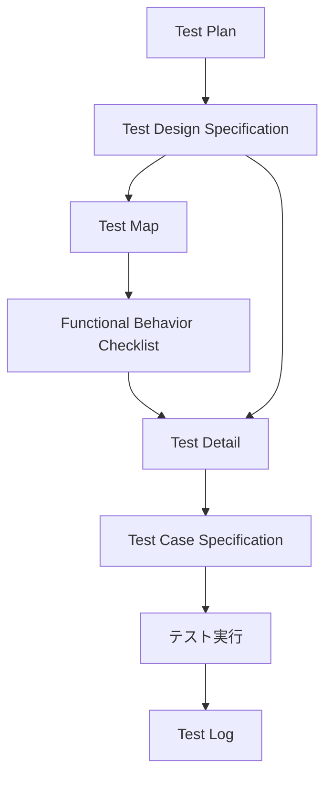

# テスト文書作成ガイドライン

## 目次

1. [概要](#1-概要)
2. [テストドキュメントの共通要素](#2-テストドキュメントの共通要素)
3. [Test Plan](#3-test-plan)
4. [Test Design Specification](#4-test-design-specification)
5. [Test Map](#5-test-map)
6. [Functional Behavior Checklist](#6-functional-behavior-checklist)
7. [Test Detail](#7-test-detail)
8. [Test Case Specification](#8-test-case-specification)
9. [Test Log](#9-test-log)
10. [テンプレート](#10-テンプレート)
11. [参考資料](#11-参考資料)

---

## 1. 概要

本書は、Test Plan、Test Design Specification、Test Map、Functional Behavior Checklist、Test Detail、Test Case Specification、Test Logの作成方法を定める。

文書の流れは次のとおりである。

Test Map、Functional Behavior Checklist、Test Detailは、Test Design Specificationのテスト設計の流れで作成する資料である。

---

## 2. テストドキュメントの共通要素

テストドキュメントや記録には、次の情報を記載する。

| 要素 | 内容 |
| --- | --- |
| 一意の識別子 | タイトル、発行日、バージョン、文書のステータスなど、文書や記録を一意に識別する情報。 |
| 発行組織 | テストドキュメントの作成と発行に責任を持つ組織。 |
| 承認権限 | テストドキュメントや記録の責任者。 |
| 変更履歴 | テストドキュメントや記録の開始以降に行われた変更のログ。 |
| ステータス | 作成中、承認済みなど、テストドキュメントの現在状態。 |
| はじめに | テストドキュメントや記録の背景や成り立ち。 |
| スコープ | テストドキュメントや記録が対象とする範囲。除外や制限がある場合は記載する。 |
| リファレンス | 参照した他の文書または記録と、その保管場所。 |
| 用語集 | テストドキュメントで使用する用語、略語、頭字語の説明。 |

---

## 3. Test Plan

### 3.1 役割

Test Planは、テストの設計、実装、実施、管理に関する指針を定め、テストの目的、背景、スコープ、スケジュール、役割、体制、リスクなどを整理する。

テンプレートのサンプルを形式的に埋めるのではなく、テスト対象やプロジェクト内容に応じて変更する。

### 3.2 ISO/IEC/IEEE 29119対応時の必須項目

Test Planテンプレートでは、次の項目がISO/IEC/IEEE 29119対応時の必須項目として示されている。

| 箇所 | 必須項目 |
| --- | --- |
| 表紙 | ドキュメント識別番号、バージョン、発行組織 |
| 改訂履歴 | 改訂履歴、バージョン、承認者 |
| 1.1 | 本ドキュメントの位置づけ |
| 2.1 | 本書の対象 |
| 2.2 | リファレンス（参考資料）およびテストベース |
| 3.1 | テストの背景 |
| 3.2 | テストの目的および目標 |
| 4.1 | 対象テストレベル |
| 4.4 | テストアイテム |
| 4.5 | テストタイプ |
| 6.2 | テスト対象範囲 |
| 7.1 | プロダクトリスク |
| 8.5 | テストに用いる技法 |
| 9.1 | テスト期間 |
| 9.2 | スケジュール |
| 9.3 | 成果物 |
| 9.4 | 見積 |
| 10.1 | テスト開始／終了基準 |
| 10.2 | テスト中断／再開基準 |
| 10.3 | テスト完了基準 |
| 10.4 | 再テスト／リグレッションテスト実施条件 |
| 10.5 | テスト実施結果の判定基準 |
| 11.1 | 収集するメトリクス |
| 12.1 | テスト環境要件 |
| 12.2 | テストデータ要件 |
| 13.3 | テスト体制 |
| 13.5 | ステークホルダー |
| 13.8 | テスト実施者の独立性 |
| 14.2 | プロジェクトリスク |
| 16.1 | 用語集 |
| 16.2 | 参考文献 |

### 3.3 本書の対象

テストのスコープを明確にするため、テスト対象、対象ユーザー、システムの目的、システムの利用方法に関する詳細、開発分類を記載する。

スコープに含まれる補足事項、除外、制限、仮定がある場合も記載する。

### 3.4 テストの背景、目的および目標

対象のプロジェクト、テストレベル、テストタイプ、そのほかの前後関係や状況を記載する。

テンプレートでは背景を「現在の状況」と「問題点／懸念事項」に分けているが、この区分だけに限定する必要はない。

### 3.5 テストレベル

単体テスト、結合テスト、システムテスト、受入テストなど、この計画で対象とするテストの段階を明確にする。

### 3.6 テストアイテム

このテストでカバーする対象要素を識別する。

対象となるファームウェアやソフトウェアのバージョン、リビジョン情報がある場合は明確にする。

### 3.7 テストタイプ

機能テスト、性能テスト、ストレステストなど、この計画で扱うテストタイプを明確にする。

### 3.8 リスク

テスト計画活動で特定したリスクを列挙し、影響と確率に基づいて評価・分析する。

リスクの種類、分類、リスクスコアに基づいて、リスクを処理するための手段を特定する。

プロダクトリスクとプロジェクトリスクを分けて管理する。

### 3.9 テストに用いる技法

テスト計画のスコープに対して、使用するテスト設計技法を指定する。

### 3.10 テスト開始／終了基準

テストの開始基準と終了基準を明確にする。

プロセス、テストレベル、テストタイプによって異なる基準を定める場合は、それぞれ記載する。

### 3.11 テスト中断／再開基準

対象のテスト活動を中断、再開するための基準を指定する。

中断と再開を判断する権限を持つ者も特定する。

### 3.12 テスト完了基準

テストの完了基準を明確にする。

使用するテスト技法について、テスト実行が完了したとみなす条件がある場合は、その条件を記載できる。

### 3.13 収集するメトリクス

対象のテストで収集し、モニタリングするメトリクスを明確にする。

開発規模など、開発側からの情報提供が必要なデータがある場合は、事前に情報提供が可能か確認する。

---

## 4. Test Design Specification

### 4.1 役割

Test Design Specificationは、テスト対象全体を見据え、「どの部分をテストするのか」「どのような内容のテストをするのか」を明確にし、テストの指針や骨格を定める。

Test Planを基に作成する。

規模が大きい場合や、テストタイプごとに分ける場合は、分冊して作成できる。

### 4.2 主な内容

主な内容は次のとおりである。

- テストの目的と背景、重要テスト項目。
- テスト設計のプロセス定義。
- テストアプローチ。
- テスト環境・使用機材。

プロジェクトに応じて必要な項目を追加または変更できる。

### 4.3 テストの目的と背景、重要テスト項目

Test Planで整理した内容を、Test Design Specificationの記載範囲に合わせて再確認する。

プロジェクトの状況やテストへの要求を把握し、その内容を基にテストの指針を定める。

### 4.4 テスト設計のプロセス定義

テスト設計工程の手順を記載する。

組織で定義した標準的なプロセスをプロジェクト向けに変更した場合や、独自の工程を追加した場合は、実際に使用する流れを文書化して共有する。

### 4.5 テストアプローチ

「どの部分をテストするのか」「どのような内容のテストをするのか」を定義するため、テスト対象機能一覧とテスト観点一覧を作成する。

#### テスト対象機能一覧

テストを設計、実施しやすい単位に対象を分割する。

開発資料に分類や用語が定義されている場合は、それを基にする。

細分化しすぎてテストの全体像が分かりにくくならない粒度にする。

#### テスト観点一覧

テスト観点は、「どのような内容のテストを実施するのか」というテストの切り口を表す。

利用できる観点一覧や過去のプロジェクト資産がある場合は参考にできるが、対象固有の観点を見落とさないよう、テスト対象の分析も行う。

細分化しすぎず、何を確認すればよいか想像できる抽象度にする。

### 4.6 重要度

機能と観点に重要度を設定し、どの程度重点的にテストするかを定める。

Test Planで決定した重要度の方針を引き継ぐ。

設計を進めた結果、重要度の見直しが必要と分かった場合は、必要に応じてTest Planまで戻って検討する。

### 4.7 テスト環境・使用機材

テストに必要な環境や使用機材を整理する。

機材の調達、テスト環境のセットアップ、事前の動作確認、必要なトレーニングなど、テスト実施前に準備するタスクも洗い出す。

### 4.8 作成時の注意点

後続のTest MapやFunctional Behavior Checklistなどの基になるため、具体的にどのようなテストをするのかを想像しながら作成する。

他の人が参照することを前提に、分かりやすい記述と分類にする。

### 4.9 活用

Test Design Specificationは、次の用途で利用する。

- ステークホルダーと、テストがシステムへの要求やテストへの要求に合致しているかを確認する。
- 複数人でテスト設計を行う場合の方針をそろえる。
- テストケースと開発仕様書のトレーサビリティを取る資料として利用する。
- テスト実施者がテスト全体の方向性やテストケースの作成意図を理解するために利用する。
- 保守や派生開発で、既存のテストケースを流用する範囲を判断するために利用する。

---

## 5. Test Map

### 5.1 役割

Test Mapでは、テスト対象機能とテスト観点をマトリクス化し、テスト実施可否や重要度を決定する。

### 5.2 記載内容

テスト対象機能として、No、大項目、中項目、小項目、重要度を記載する。

テスト観点として、No、大分類、中分類、小分類を記載する。

機能と観点の交点には、テンプレートで定義されている次の記号を使用できる。

| 記号 | 意味 |
| --- | --- |
| A | 重点的に実施 |
| B | 普通 |
| C | 最低限実施 |
| － | 実施不可 |
| NT | 実施なし |
| ○ | 実施 |
| △ | 実施検討 |

特記事項がある場合は、特記事項欄へ記載する。

---

## 6. Functional Behavior Checklist

### 6.1 役割

Functional Behavior Checklistは、観点「機能動作」に対して、機能ごとの確認内容を明確にするために使用する。

### 6.2 記載内容

| 項目 | 内容 |
| --- | --- |
| No. | 項目番号 |
| 大項目 | 該当テスト項目で確認する機能の大分類 |
| 中項目 | 該当テスト項目で確認する機能の中分類 |
| 小項目 | 該当テスト項目で確認する機能の小分類 |
| 機能要件（要求／リスクベース） | 機能に対して必要な要件 |
| 確認内容 | 機能要件の確認に必要な内容 |
| 備考 | 補足事項 |

特記事項がある場合は、特記事項欄へ記載する。

---

## 7. Test Detail

### 7.1 役割

Test Detailでは、テスト対象となる機能と観点の組合せに対して、実施するテスト内容の明細を記載する。

### 7.2 グループ項目

| 項目 | 内容 |
| --- | --- |
| テスト対象1 | テストを実施する対象システム |
| テスト対象2 | テストを実施する対象システム内要素 |
| テストタイプ | 該当テストの分類 |
| 大項目 | 該当テスト項目で確認する機能の大分類 |

### 7.3 個別項目

| 項目 | 内容 |
| --- | --- |
| テストセットID | 該当テストセットの識別番号 |
| 中項目 | 該当テスト項目で確認する機能の中分類 |
| 小項目 | 該当テスト項目で確認する機能の小分類 |
| セット内容 | テストセットの内容説明 |
| テスト観点 | Test Mapにおけるテスト対象機能に対応したテスト観点 |
| 確認内容 | テスト観点ごとの詳細な確認内容。観点一覧から抽出し、詳細化する。 |
| テストパラメータ | 確認内容の入力条件パターン |
| 件数 | 該当のテスト実施時に必要となるテスト件数 |

テンプレートでは、テストパラメータを因子／水準として記載する。

---

## 8. Test Case Specification

### 8.1 役割

Test Case Specificationは、Test Detailを基に、具体的なテスト手順書として作成する。

テスト設計時にはテスト対象、テストタイプ、機能分類、テスト観点、実施条件、実施手順、期待結果を記載する。

テスト実行後には、同じテストケースの結果記載欄へ結果、環境、バージョン、実施日、バグID、実施者、備考を記録する。

### 8.2 グループ項目

| 項目 | 内容 |
| --- | --- |
| テスト対象1 | テストを実施する対象システム |
| テスト対象2 | テストを実施する対象システム内要素 |
| テストタイプ | 該当テストの分類 |
| 機能大項目 | 該当テスト項目で確認する機能の大分類 |
| 予定実施時間 | 実施するのにかかる時間（予定） |
| 注意事項 | テストを実施する際の注意事項 |

### 8.3 テスト項目

| 項目 | 内容 |
| --- | --- |
| テストケースNo | 該当テスト項目の識別番号。`テストセットID-ケースNo-期待結果枝番`の形式で記載する。 |
| 機能中項目 | 該当テスト項目で確認する機能の中分類 |
| 機能小項目 | 該当テスト項目で確認する機能の小分類 |
| テスト観点 | テスト実施の詳細な手順 |
| 実施条件 | テスト実施に必要な条件 |
| 実施手順 | テスト実施の詳細な手順 |
| 期待結果 | テスト実施時に期待される結果 |

### 8.4 結果記載欄

| 項目 | 内容 |
| --- | --- |
| 結果 | テスト実施結果のステータス。ステータスの詳細はTest Planを参照する。 |
| 環境 | 不具合が発生した場合、不具合の識別番号 |
| バージョン | テストを実施したテスト対象のバージョン |
| 実施日 | テストを実施した日付 |
| バグID | 不具合が発生した場合、不具合の識別番号 |
| 実施者 | テストを実施した人の氏名 |
| 備考 | テスト確認内容・確認結果の詳細など |

### 8.5 項目別の書き方

#### テスト対象

ソフトウェアのどの部分をテストの対象とするかを記載する。

機能や画面、入力項目などが多い場合は、大項目、中項目、小項目に分ける。

#### テスト観点

テスト実施の詳細な手順を記載する。

#### 実施条件

テスト実施に必要な条件を記載する。

#### 実施手順

テスト実施の詳細な手順を記載する。

#### 期待結果

テスト実施時に期待される結果を記載する。

### 8.6 作成時のポイント

テストケースNoは、Test Design Specificationで定義されている`テストセットID-ケースNo-期待結果枝番`の形式を使用する。

結果のステータスは、Test Planのテスト実施結果の判定基準を参照する。

### 8.7 集計欄

配布されたテストケーステンプレートには、総項目数、有効項目数、OK、再確認OK、NG、QA、保留、NT、N/A、未実施、進捗率の集計欄がある。

本Markdownテンプレートでは、スプレッドシートで自動計算される集計欄は設けない。

---

## 9. Test Log

### 9.1 役割

Test Logは、Test Planの「10.8 テスト実行時の記録について」で定めるテスト実行ログを記録する。

Test Case Specificationにも結果記載欄を持たせ、Test Logを理由として結果記載欄を省略しない。

### 9.2 記録項目

| 項目 | 内容 |
| --- | --- |
| テストケースNo | 実行したテストケースを識別する番号 |
| 判定結果 | テスト実施結果の判定結果 |
| テスト実施日 | テストを実施した日付 |
| テスト実施者 | テストを実施した担当者 |
| テスト実行環境 | バージョンなどを含むテスト実行環境 |
| 管理ID | 判定結果がNGの場合に発行したインシデントの管理ID |
| 画面キャプチャ | 不具合発生時に必要な場合に残す画面キャプチャ |

再テストがOKになった場合は、該当するインシデントを更新する。

---

## 10. テンプレート

- [Test Plan](../../templates/documentation/test-plan.md)
- [Test Design Specification](../../templates/documentation/test-design-specification.md)
- [Test Map](../../templates/documentation/test-map.md)
- [Functional Behavior Checklist](../../templates/documentation/functional-behavior-checklist.md)
- [Test Detail](../../templates/documentation/test-detail.md)
- [Test Case Specification](../../templates/documentation/test-case-specification.md)
- [Test Log](../../templates/documentation/test-log.md)

---

## 11. 参考資料

| 本書の章 | 参考資料 | 説明 |
| --- | --- | --- |
| 2. テストドキュメントの共通要素 3. Test Plan 9. Test Log | [テスト計画書とは？テンプレート(29119規格対応)の書き方11ステップを解説 \| Qbook](https://www.qbook.jp/column/1676.html) | Test Planの役割、29119規格対応項目、テストドキュメントの共通要素を説明している。 |
| 4. Test Design Specification 5. Test Map 6. Functional Behavior Checklist 7. Test Detail | [テスト設計仕様書とは？各項目と作成の流れ・注意点・使い方を解説 \| Qbook](https://www.qbook.jp/column/1677.html) | Test Design Specificationの役割、テスト設計の流れ、テスト対象機能、テスト観点を説明している。 |
| 5. Test Map | [テストマップとは？テストを俯瞰し、抜け漏れ防止やテストケース数のバランス調整を行おう \| Qbook](https://www.qbook.jp/column/744.html) | Test Mapの目的と機能・観点の対応関係を説明している。 |
| 8. Test Case Specification | [テストケースの書き方を項目別に解説！【作成例・テンプレート付き】\| Qbook](https://www.qbook.jp/column/1794.html) | Test Caseの項目別の記述方法と集計機能を説明している。列構成は配布テンプレート本体を優先する。 |
