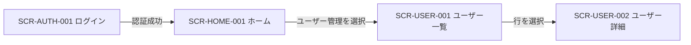
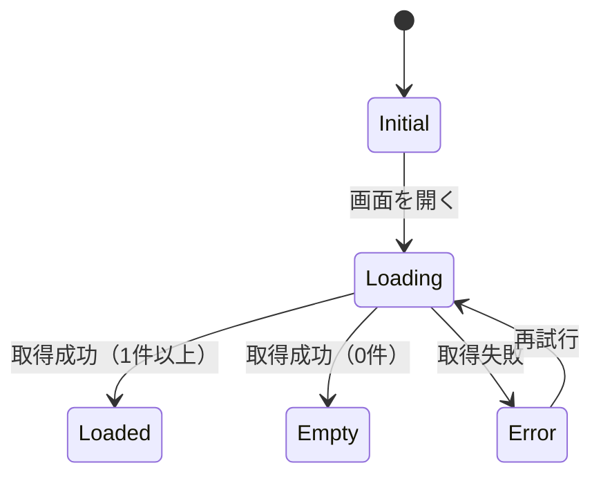

# UI仕様書 作成規約（大規模開発・汎用版）

> 適用対象: UI仕様書を新規作成または変更する場合。

> **目的**：どのプロジェクト・チーム・フェーズでも、仕様書が「唯一の真実のソース（Single Source of Truth）」として機能し、認識齟齬・手戻り・属人化を排除する。UI仕様書は見た目を説明する資料ではなく、画面に表示する情報・ユーザー操作・状態遷移・入力規則・例外処理・権限制御・レスポンシブ対応・アクセシビリティ・受け入れ条件を定義する正式な仕様書である。

---

## 0. 前提原則

| 原則 | 理由 |
|------|------|
| **仕様書はコードより優先する** | 実装が仕様を上書きすると仕様の意味が消え、後続工程が崩壊する |
| **変更は仕様書から始める** | 実装先行の変更が仕様書と乖離すると追跡不能になる |
| **一つの記述に一つの意味だけを持たせる** | 曖昧な表現は実装者の解釈に依存し、品質がバラつく |
| **正式な識別子を全対象に付ける** | IDがなければ状態定義・エラー仕様・テスト仕様を横断して参照できない |
| **表示仕様と内部実装を分離する** | フレームワーク固有の実装方法は仕様書に記載しない。ユーザーから観測できる挙動だけを定義する |
| **共通仕様を重複記載しない** | 全画面共通のルールは共通規約へ記載し、個別画面には差分だけを記載する |
| **正常系・空状態・処理中・失敗・権限制御を省略しない** | これらの漏れはQA網羅性欠如と実装バグの温床になる |

### 曖昧表現の禁止

| 使用しない表現 | 正式な記述例 |
|---|---|
| 適宜表示します | `items.length > 0` の場合に表示します。 |
| 必要に応じて無効化します | `isSubmitting = true` の場合に無効化します。 |
| エラー時にメッセージを表示します | HTTP 409 の場合に、フォーム上部へ `このデータは他のユーザーによって更新されました。再読み込みしてください。` と表示します。 |
| スマートフォンでは小さくします | ビューポート幅が 767px 以下の場合に、2列を1列へ変更します。 |
| 管理者のみ操作できます | `role = admin` の場合だけ操作ボタンを表示します。 |

### 実装詳細の記載禁止

| UI仕様書に記載する内容 | UI仕様書に記載しない内容 |
|---|---|
| ボタンを押した後にローディング表示へ遷移します。 | `useState` を使用します。 |
| 送信中は二重送信を防止します。 | debounce 関数を使用します。 |
| 画面幅 768px 以上では2列表示にします。 | CSS Grid の `grid-template-columns` を使用します。 |
| 入力値をAPIへ送信します。 | Repository クラスから HTTP クライアントを呼び出します。 |

---

## 1. 識別子の命名規則

画面・モーダル・部品・操作・入力項目・メッセージ・状態・イベントには一意な識別子を付ける。一度公開した識別子を別の用途へ再利用しない。

| 対象 | 命名形式 | 例 |
|---|---|---|
| 画面 | `SCR-<DOMAIN>-<NNN>` | `SCR-USER-001` |
| モーダル | `MDL-<DOMAIN>-<NNN>` | `MDL-USER-001` |
| ドロワー | `DWR-<DOMAIN>-<NNN>` | `DWR-NOTIFY-001` |
| 共通コンポーネント | `CMP-<CATEGORY>-<NNN>` | `CMP-FORM-003` |
| 入力項目 | `FLD-<SCREEN>-<NNN>` | `FLD-USER-001-003` |
| 操作 | `ACT-<SCREEN>-<NNN>` | `ACT-USER-001-002` |
| メッセージ | `MSG-<CATEGORY>-<NNN>` | `MSG-VALIDATION-004` |
| UI状態 | `STATE-<SCREEN>-<NAME>` | `STATE-USER-001-LOADING` |
| イベント | `EVT-<SCREEN>-<NNN>` | `EVT-USER-001-002` |

---

## 2. ファイル構成

### 2-1. ディレクトリ構造（標準）

```text
ui-spec/
├── README.md
├── 00-glossary.md
├── 01-common-rules.md
├── 02-navigation.md
├── 03-screen-catalog.md
├── 04-message-catalog.md
├── 05-permission-matrix.md
├── 06-responsive-rules.md
├── 07-accessibility-rules.md
├── components/
│   ├── CMP-BUTTON-001.md
│   ├── CMP-FORM-001.md
│   └── CMP-TABLE-001.md
└── screens/
    ├── SCR-AUTH-001-login.md
    ├── SCR-USER-001-user-list.md
    └── SCR-USER-002-user-detail.md
```

**理由**：関心の分離により、担当者が必要な仕様だけを参照・更新できる。巨大な単一ファイルは検索・レビュー・差分管理が崩壊する。

### 2-2. 各ファイルの責務

| ファイル | 記載内容 |
|---|---|
| `README.md` | 仕様書の目的、対象システム、管理方法、関連資料 |
| `00-glossary.md` | 用語・表記・業務上の意味 |
| `01-common-rules.md` | 全画面共通のUI挙動 |
| `02-navigation.md` | 画面遷移・URL・ディープリンク・戻る操作 |
| `03-screen-catalog.md` | 全画面の一覧 |
| `04-message-catalog.md` | 表示メッセージの一元管理 |
| `05-permission-matrix.md` | ロール別の閲覧権限と操作権限 |
| `06-responsive-rules.md` | ブレークポイントと画面幅別の共通ルール |
| `07-accessibility-rules.md` | キーボード操作・フォーカス・読み上げ・代替テキスト |
| `components/*.md` | 再利用するUI部品の仕様 |
| `screens/*.md` | 個別画面の仕様 |

UI仕様書には、他の成果物（API仕様書・業務仕様書）の内容を全文重複記載しない。UIに影響する条件だけを記載し、詳細は正式な参照先へリンクする。

### 2-3. 小規模プロジェクトの扱い

画面数が10未満の場合は単一ファイルへの記載を許容する。ただし画面数が10以上になった時点で責務ごとにファイルを分割する。

---

## 3. 仕様書のヘッダー（全ファイル必須）

すべての仕様書ファイルの冒頭に以下を記述する。

```markdown
---
id: SCR-USER-001
title: ユーザー一覧
status: draft
version: 1.0.0
author: 山田 太郎
last_updated: 2025-06-01
reviewers:
  - 鈴木 花子（デザイン）
  - 田中 一郎（フロントエンド）
related:
  - SCR-USER-002-user-detail
  - CMP-TABLE-001
---
```

**理由**：仕様書のライフサイクル（誰が・いつ・何のステータスで書いたか）が追跡できなければ、どれが最新で誰が承認したかが不明になる。`related` で依存関係を明示することで影響範囲調査が可能になる。

### ステータス定義

| ステータス | 意味 | 次のアクション |
|---|---|---|
| `draft` | 作成中・未レビュー | レビュー依頼 |
| `review` | レビュー中（PR作成済み） | レビュー指摘の対応 |
| `approved` | 承認済み・実装可能 | 実装開始 |
| `deprecated` | 廃止（削除はしない） | 後継仕様書へのリンクを追記 |

`deprecated` を削除しないのは、過去の設計判断の根拠を残すためである。

---

## 4. バージョン管理ルール

セマンティックバージョニング（`MAJOR.MINOR.PATCH`）を使用する。

| 区分 | 対象 |
|---|---|
| `MAJOR` | UIの振る舞い・要素構成の破壊的変更 |
| `MINOR` | 後方互換のある機能追加（要素追加・状態追加） |
| `PATCH` | 文言修正・誤記訂正・図の差し替え |

仕様書の更新はUI変更と同じプルリクエストで行う。仕様書だけを別コミットに分離してコード変更と対応関係を失わせない。

---

## 5. 記述形式

### 5-1. Markdownを正式形式とする

UI仕様書の正式形式はMarkdownとする。Markdownは差分レビュー・全文検索・リンク・表・履歴管理・自動検証に適している。デザインファイルだけをUI仕様書として扱わない。デザインファイルは寸法・色・余白・配置・視覚表現を確認する参照資料として使用する。

### 5-2. 文体の統一

| 規則 | 正式な記述例 |
|---|---|
| 主語を明示する | システムは、検索条件に一致するユーザーを表示します。 |
| 条件を明示する | `status = active` の場合に、ステータス列へ `有効` と表示します。 |
| 操作を明示する | ユーザーが保存ボタンを押した場合に、システムは入力値を送信します。 |
| 結果を明示する | 登録が成功した場合に、システムは詳細画面へ遷移します。 |
| 対象位置を明示する | システムは、フォーム上部へエラーサマリーを表示します。 |
| 時点を明示する | システムは、フォーカスが入力欄から外れた時点で形式を検証します。 |

### 5-3. 仕様値と説明文の分離

閾値・文字列・URL・識別子・列挙値・コードはバッククォートで囲む。

- ビューポート幅が `767px` 以下の場合に、システムは1列表示へ切り替えます。
- APIが `HTTP 401` を返した場合に、システムは `SCR-AUTH-001` へ遷移します。
- 入力値が `100` 文字を超える場合に、システムは `MSG-VALIDATION-003` を表示します。

### 5-4. 表を基本形式とする

同じ項目が繰り返される仕様は文章ではなく表で記載する。表の各セルには原則として一つの規則だけを記載する。複数の規則が必要な場合は行を分割する。

### 5-5. Mermaidで図を記述する

画面遷移・状態遷移・複数システム間の処理順序はMermaidで記載する。

**画面遷移図の例：**



**状態遷移図の例：**



---

## 6. 共通規約に記載する内容

### 6-1. 画面の状態（全画面で検討必須）

各画面は最低限、次の状態を検討する。対象外の状態には `対象外` と記載し理由を記載する。空欄のままにしない。

| 状態 | 説明 |
|---|---|
| Initial（初期状態） | 画面を開いた直後の状態 |
| Loading（読み込み中） | 初回データを取得中の状態 |
| Loaded（正常状態） | データ取得または操作が成功した状態 |
| Empty（空状態） | 正常に取得できたが表示対象が0件の状態 |
| Refreshing（再取得中） | 現在の表示を維持したまま再取得している状態 |
| Submitting（送信中） | 登録・更新・削除などを処理中の状態 |
| Error（通信エラー） | 通信またはサーバー処理が失敗した状態 |
| Forbidden（権限不足） | ユーザーが閲覧または操作権限を持たない状態 |
| SessionExpired（セッション切れ） | 認証情報が失効した状態 |
| Conflict（競合） | 他の更新と競合した状態 |

### 6-2. 通信中の表示

| 対象 | 規則 |
|---|---|
| 初回取得 | コンテンツ領域へスケルトンまたはローディング表示を表示します。 |
| 再取得 | 現在の表示を維持し、更新中であることを示します。 |
| 登録・更新・削除 | 実行ボタンを無効化し、処理中であることを示します。 |
| 二重送信 | 同一処理の完了前に再送信しません。 |
| 長時間処理 | 進行状況を取得できる場合は、進捗を表示します。 |

### 6-3. エラー表示

| 種別 | 表示位置 | 規則 |
|---|---|---|
| 入力項目単位のエラー | 対象入力欄の直下 | エラー内容と修正方法をテキストで表示します。 |
| フォーム全体のエラー | フォーム上部 | エラーサマリーを表示し、対象入力欄へ移動できるリンクを付けます。 |
| 通信エラー | コンテンツ領域または通知領域 | 原因に応じたメッセージと再試行手段を表示します。 |
| 操作失敗 | 通知領域 | 失敗した操作と、ユーザーが次に実行できる操作を表示します。 |
| 権限不足 | 画面全体または対象操作箇所 | 閲覧不可または操作不可であることを表示します。 |

色だけでエラーを表現しない。アイコンだけでエラーを表現しない。テキストを必ず表示する。

### 6-4. フォーム

| 項目 | 規則 |
|---|---|
| ラベル | 入力欄ごとに常時表示します。プレースホルダーだけで項目名を表現しません。 |
| 必須・任意表示 | プロジェクト内で統一します。必須項目が少ない場合は必須を示し、任意項目が少ない場合は任意を示します。 |
| プレースホルダー | 入力例または形式例として使用します。ラベルの代替には使用しません。 |
| バリデーション契機 | 入力中・フォーカスアウト時・送信時のどの時点で検証するかを定義します。 |
| 送信失敗時の入力値 | セキュリティ上の理由がない限り、ユーザーが入力した値を保持します。 |
| 未保存変更 | 画面離脱時に確認する条件を定義します。 |

### 6-5. 削除と不可逆操作

| 項目 | 規則 |
|---|---|
| 確認 | 取り消せない操作の実行前に確認します。 |
| 対象 | 削除対象の名称または件数を表示します。 |
| 影響 | 関連データへの影響を表示します。 |
| 操作名 | `はい` ではなく `削除する` などの具体的な動詞を表示します。 |
| 完了 | 成功通知と、一覧更新または遷移先を定義します。 |
| 失敗 | 削除できない理由と、次の操作を表示します。 |

### 6-6. アニメーション

アニメーションは種別・プロパティ・値・イージングを定義する。`prefers-reduced-motion: reduce` 時はすべてのアニメーションを無効にする。これを共通規約に明記し、個別画面では差分だけを記載する。

---

## 7. デザイントークンの参照ルール

色・余白・角丸・影・文字サイズをUI仕様書へ直接記述しない。デザイントークン名で参照する。個別画面でトークンを使わず直接値を使用する場合は、その理由を記載する。

| 種別 | 記載例 |
|---|---|
| テキスト色 | `color.text.primary` |
| 背景色 | `color.background.surface` |
| エラー色 | `color.feedback.error` |
| 余白 | `space.300` |
| 角丸 | `radius.medium` |
| 文字 | `typography.body.medium` |
| 影 | `elevation.dialog` |
| アイコンサイズ | `icon.size.medium` |

**理由**：トークン名で記述することで、デザインシステムの変更が仕様書の記述を変えずに全体に波及する。数値の直接記述は変更漏れの原因になる。

---

## 8. デザインファイルとの責務分担

| 項目 | UI仕様書 | デザインファイル |
|---|---|---|
| 画面の目的 | 記載する | 原則として補足だけ |
| 表示条件 | 記載する | 必要に応じて注釈 |
| 状態遷移 | 記載する | 主要状態の見本を示す |
| 入力規則 | 記載する | エラー表示の見本を示す |
| 権限制御 | 記載する | 必要に応じて差分を示す |
| 寸法・余白 | デザイントークン名またはデザイン参照へ委譲 | 記載する |
| 色・フォント | デザイントークン名を記載する | 視覚表現を示す |
| アイコン | アイコン名と用途を記載する | 視覚表現を示す |

---

## 9. 個別画面仕様のテンプレート

個別画面仕様は `screens/*.md` として独立ファイルで管理する。テンプレートファイルは `screen-spec-template.md` を参照する。

### セクション構成（省略不可のセクションには ★ を付ける）

| # | セクション名 | 省略 | 補足 |
|---|---|---|---|
| 1 | 基本情報 | ★ | ヘッダーと合わせて記載する |
| 2 | 画面概要 | ★ | 2文以内で目的を記載する |
| 3 | 表示項目 | ★ | 取得元・表示条件・欠損時を必ず定義する |
| 4 | 入力項目 | ★ | 入力がない場合は「対象外」と理由を記載する |
| 5 | 操作 | ★ | 起点・実行条件・成功時・失敗時・連打防止を定義する |
| 6 | 一覧仕様 | 任意 | 一覧を持たない画面は「対象外」と理由を記載する |
| 7 | 状態 | ★ | 対象外の状態も「対象外」と理由を記載する。空欄不可 |
| 8 | 状態遷移図 | ★ | Mermaid の stateDiagram-v2 で記述する |
| 9 | API連携 | ★ | 契機・成功時の反映・HTTPステータス別エラー処理を記載する |
| 10 | エラー処理 | ★ | メッセージIDで参照する。文言を直接記述しない |
| 11 | 権限制御 | ★ | URL直接入力・API拒否まで含めて記載する |
| 12 | レスポンシブ | ★ | 共通規約と同じ場合は「共通規約に準拠」と記載し差分のみ記述する |
| 13 | アクセシビリティ | ★ | 共通規約と同じ場合は「共通規約に準拠」と記載し差分のみ記述する |
| 14 | 未保存変更 | 任意 | 不要な場合は「対象外」と理由を記載する |
| 15 | 受け入れ条件 | ★ | ユーザーから観測できる結果として記載する |
| 16 | 変更履歴 | ★ | バージョン・日付・変更者・変更内容・承認者を記載する |
| 17 | 対象外 | ★ | 検討したが対象外とした項目と理由を記載する |

---

## 10. バリデーション規約

### 10-1. バリデーションの分類

| 分類 | 例 | 実行場所 | UI仕様書への記載 |
|---|---|---|---|
| 必須検証 | 未入力 | UI・API | 記載する |
| 形式検証 | メールアドレス形式不正 | UI・API | 記載する |
| 範囲検証 | 100文字超 | UI・API | 記載する |
| 相関検証 | 開始日が終了日より後 | UI・API | 記載する |
| 業務検証 | 同一識別子が既に存在する | API | UI上の表示方法を記載する |
| 権限検証 | 操作権限なし | API | UI上の表示方法を記載する |
| 競合検証 | 他のユーザーが更新済み | API | UI上の表示方法を記載する |

### 10-2. エラー表示の順序

複数の検証エラーが同時に発生する場合は、画面上部から下部へ並べる。フォーム上部のエラーサマリーも同じ順序で表示する。

---

## 11. メッセージ管理ルール

メッセージはすべて `04-message-catalog.md` で一元管理する。個別画面でメッセージ文言を直接記述しない。

| メッセージID | 種別 | 表示文言 | 表示条件 | 表示位置 | 次の操作 |
|---|---|---|---|---|---|
| MSG-VALIDATION-001 | 入力エラー | 必須項目です。 | 必須項目が未入力 | 対象入力欄の直下 | 入力します。 |
| MSG-NETWORK-001 | 通信エラー | データを取得できませんでした。再試行してください。 | データ取得に失敗 | コンテンツ領域 | 再試行します。 |
| MSG-SUCCESS-001 | 成功 | 保存しました。 | 保存に成功 | 通知領域 | 対象外 |

### メッセージの記述規則

| 規則 | 説明 |
|---|---|
| 原因を示す | ユーザーが何に失敗したかを理解できる文言にします。 |
| 次の操作を示す | 再試行・修正・問い合わせなどを明示します。 |
| 内部情報を表示しない | スタックトレース・SQL・内部ID・機密情報を表示しません。 |
| 色だけで区別しない | テキストと必要に応じてアイコンを使用します。 |

---

## 12. 権限制御ルール

| 状況 | 規則 |
|---|---|
| 閲覧権限がない画面へURLを直接入力した場合 | 権限不足画面を表示するか、安全な画面へ遷移します。 |
| 実行権限がない操作の場合 | 原則として操作要素を表示しません。 |
| 状態によって一時的に実行できない操作の場合 | 操作要素を無効化し、理由を確認できるようにします。 |
| APIが権限エラーを返した場合 | UI側の表示状態に関係なく権限不足として処理します。 |

権限マトリクスは `05-permission-matrix.md` で一元管理する。

---

## 13. URL・ナビゲーション・戻る操作

| 項目 | 規則 |
|---|---|
| URL | 画面を特定できる正式なURLまたはルートを記載します。 |
| パスパラメーター | 名称・意味・存在しない場合の処理を記載します。 |
| クエリパラメーター | 名称・型・初期値・許可値・URLへの保持条件を記載します。 |
| ブラウザ履歴 | 追加・置換・履歴へ残さない処理を区別します。 |
| 戻る操作 | ブラウザバック・OS標準戻る・画面内戻るボタンの動作を定義します。 |
| ディープリンク | 未認証時・権限不足時・対象データ不存在時の処理を定義します。 |
| 再読み込み | 入力値・検索条件・選択状態の保持可否を定義します。 |

---

## 14. 表示形式の規約

| 対象 | 定義する内容 |
|---|---|
| 日付 | 表示形式・タイムゾーン・未設定時・入力形式 |
| 日時 | 表示形式・秒の有無・タイムゾーン変換 |
| 数値 | 桁区切り・小数桁・丸め方法・負数の表示 |
| 通貨 | 通貨記号・通貨コード・端数処理 |
| 長文 | 折り返し・省略・全文確認方法 |
| 空値 | `-`・空欄・`未設定`・非表示のいずれかを統一して定義する |
| 列挙値 | API値とUI表示名の対応表 |

---

## 15. 禁止事項

| 禁止事項 | 理由 |
|---|---|
| デザイン画像だけで仕様を完結させる | 条件・状態・操作・例外を判定できません。 |
| 画面ごとに共通仕様を複製する | 更新漏れと矛盾が発生します。 |
| `適宜`・`必要に応じて`・`いい感じに` などの曖昧語を使用する | 実装結果とテスト結果を一意に決められません。 |
| エラー時の表示を省略する | 実装とテストで判断が分かれます。 |
| ローディング状態を省略する | 二重送信や表示崩れが発生します。 |
| 権限制御を画面表示だけで完結させる | URL直接入力やAPI直接呼び出しへ対応できません。 |
| 色だけで状態を表現する | 視認できないユーザーが状態を判断できません。 |
| プレースホルダーだけで入力項目名を示す | 入力後に項目名を確認できません。 |
| API仕様書を全文複製する | 仕様の不整合が発生します。 |
| 対象外の状態を空欄のままにする | 検討したかどうかが判断できません。 |

---

## 16. 自動検証の推奨項目

UI仕様書は可能な範囲で自動検証できる形式にする。

| 検証対象 | 検証内容 |
|---|---|
| 画面ID・コンポーネントID | 重複がないことを確認します。 |
| メッセージID参照 | 参照先が `04-message-catalog.md` に存在することを確認します。 |
| 画面リンク | リンク先ファイルが存在することを確認します。 |
| Mermaid | 構文エラーがないことを確認します。 |
| 禁止語 | `適宜`・`必要に応じて` などを検出します。 |
| 必須セクション | 個別画面仕様に ★ セクションが存在することを確認します。 |

---

## 17. レビューチェックリスト

新しい画面を定義する場合はすべての項目を確認する。

```
[ ] ヘッダー（id / status / version / author / last_updated）が揃っているか
[ ] 目的が「ユーザーが達成すること」として記載されているか（見た目の説明になっていないか）
[ ] すべての要素・操作・メッセージ・状態に識別子が振られているか
[ ] 状態定義に Initial / Loading / Loaded / Empty / Error / Forbidden が含まれているか
[ ] 対象外の状態に「対象外」と理由が記載されているか（空欄になっていないか）
[ ] エラー文言がメッセージIDで参照されているか（文言の直接記述になっていないか）
[ ] APIレスポンス（HTTPステータス別）とUIの対応が記述されているか
[ ] 権限制御が URL 直接入力・API 拒否まで含めて記述されているか
[ ] アクセシビリティ要件（キーボード操作・フォーカス・読み上げ・色以外の表現）が記述されているか
[ ] Figmaリンクがフレーム単位で貼られているか
[ ] 変更履歴が更新されているか
[ ] 受け入れ条件が「ユーザーから観測できる結果」として記載されているか
[ ] 共通仕様との重複がないか（差分だけが記載されているか）
[ ] 曖昧語（適宜・必要に応じて・いい感じに）が残っていないか
```

---

## 18. 推奨運用

| 項目 | 規則 |
|---|---|
| 変更単位 | UI変更と同じプルリクエストで仕様書を更新します。 |
| レビュー | デザイン・開発・テストの観点でレビューします。 |
| 履歴 | Gitで差分を管理します。 |
| 参照 | Issue・プルリクエスト・デザインファイル・API仕様書を相互リンクします。 |
| 完了条件 | 実装完了だけでなく、仕様書と受け入れ条件の更新完了を含めます。 |
| 定期確認 | 共通規約・部品・禁止語・参照切れを定期的に確認します。 |

---

*このルール自体もバージョン管理対象とし、プロジェクト開始時にチーム全員がレビュー・合意した上で採用する。*
