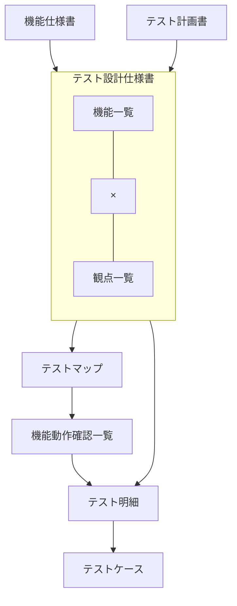

# Test Design Specification

作成方法は、[テスト文書作成ガイドライン](../../guidelines/documentation/test-documentation-guidelines.md#4-test-design-specification)に従う。

| 項目 | 内容 |
| --- | --- |
| テスト対象システム名 | <記載> |
| テストレベル／テストタイプ | <記載> |
| Ver. | `0.0.0` |
| ドキュメント識別番号 | <記載> |
| 作成年月日 | <YYYY年MM月DD日> |
| 所属 | <記載> |
| 作成者氏名 | <記載> |

## 改版履歴

| 改訂日 | Version | 改訂者 | 改訂内容及び理由 |
| --- | --- | --- | --- |
|  |  |  |  |
|  |  |  |  |
|  |  |  |  |
|  |  |  |  |
|  |  |  |  |
|  |  |  |  |
|  |  |  |  |
|  |  |  |  |
|  |  |  |  |
|  |  |  |  |
|  |  |  |  |
|  |  |  |  |
|  |  |  |  |
|  |  |  |  |
|  |  |  |  |
|  |  |  |  |
|  |  |  |  |
|  |  |  |  |
|  |  |  |  |
|  |  |  |  |
|  |  |  |  |
|  |  |  |  |
|  |  |  |  |
|  |  |  |  |
|  |  |  |  |

## 目次

| 章 | 内容 |
| --- | --- |
| 1 | はじめに |
| 2 | テスト設計の流れ |
| 3 | テストアプローチ詳細 |
| 4 | 特記事項 |

## 本ドキュメントの位置づけ

本ドキュメントは、「1 はじめに」に記載するテストにおけるテスト基本設計について記載するものである。

テストケースを作成する際に指針となるドキュメントであり、テスト計画書の内容に準じた内容である。

## 1. はじめに

### 適用範囲

本書は、テスト計画書に記載されている内容のうち、以下のもの（対象に●がついている箇所）を対象とする。

| 種別 | 内容 | 対象 |
| --- | --- | --- |
|  |  |  |
|  |  |  |
|  |  |  |
|  |  |  |

### 参考文献

| No | 分類 | 文書識別番号 | 文書名 |
| --- | --- | --- | --- |
| 1 |  |  |  |
| 2 |  |  |  |
| 3 |  |  |  |
| 4 |  |  |  |
| 5 |  |  |  |
| 6 |  |  |  |
| 7 |  |  |  |
| 8 |  |  |  |
| 9 |  |  |  |
| 10 |  |  |  |

## 2. テスト設計の流れ

テスト設計では、下記のステップを順に行うこととする。

### (1) テスト対象項目を細分化する

テスト計画書に記載のテスト対象項目をテスト設計しやすい単位に細分化する。

作成資料：機能一覧　等

### (2) テスト観点を細分化する

テスト計画書に記載のテスト観点をテスト設計しやすい単位に細分化する。

作成資料：観点一覧　等

### (3) (1)、(2)で抽出した内容をマトリクス化する

テスト対象項目と、テスト観点でマトリクスを作成し、テスト実施可否や重要度を決定する。

作成資料：テストマップ　等

### (4) (1)で抽出した機能に必要な検証内容を洗い出す

テスト対象項目に対して、各機能の目的を考慮し、その達成確認の為に必要な確認内容を洗い出す。

作成資料：機能動作確認一覧　等

### (5) テスト明細を作成する

テスト実施対象機能毎に、テスト観点に合せた入力内容を抽出、策定する。

作成資料：テスト明細　等

### (6) テストケースを作成する

テスト明細を基に、具体的なテスト手順書（テストケース）を作成する。

作成資料：テストケース

## 3. テストアプローチ詳細

テスト設計の流れを元に、各アプローチの詳細を記載する。

### テスト対象機能を細分化する

#### テスト対象機能一覧

| 機能No | 大項目 | 中項目 | 小項目 | 重要度 | 備考 |
| --- | --- | --- | --- | --- | --- |
| <記載> | <記載> | <記載> | <記載> | <記載> | <記載> |
| <記載> | <記載> | <記載> | <記載> | <記載> | <記載> |
| <記載> | <記載> | <記載> | <記載> | <記載> | <記載> |
| <記載> | <記載> | <記載> | <記載> | <記載> | <記載> |
| <記載> | <記載> | <記載> | <記載> | <記載> | <記載> |
| <記載> | <記載> | <記載> | <記載> | <記載> | <記載> |
| <記載> | <記載> | <記載> | <記載> | <記載> | <記載> |
| <記載> | <記載> | <記載> | <記載> | <記載> | <記載> |
| <記載> | <記載> | <記載> | <記載> | <記載> | <記載> |
| <記載> | <記載> | <記載> | <記載> | <記載> | <記載> |

#### 特記事項

<記載>

### テスト対象観点を細分化する

#### テスト観点一覧

| No | 大分類 | 中分類 | 小分類 | 確認内容 |
| --- | --- | --- | --- | --- |
| <記載> | <記載> | <記載> | <記載> | <記載> |
| <記載> | <記載> | <記載> | <記載> | <記載> |
| <記載> | <記載> | <記載> | <記載> | <記載> |
| <記載> | <記載> | <記載> | <記載> | <記載> |
| <記載> | <記載> | <記載> | <記載> | <記載> |
| <記載> | <記載> | <記載> | <記載> | <記載> |
| <記載> | <記載> | <記載> | <記載> | <記載> |
| <記載> | <記載> | <記載> | <記載> | <記載> |
| <記載> | <記載> | <記載> | <記載> | <記載> |
| <記載> | <記載> | <記載> | <記載> | <記載> |

#### 特記事項

<記載>

### 抽出した機能および観点をマトリクス化する（テストマップ）

テスト対象となる機能および観点の相関図及び確認重要度を記載する。

別資料「テストマップ」を参照のこと。

<テストマップの参照先>

### 観点「機能動作」に対して、機能毎の確認内容を明確にする

別資料「機能動作確認一覧」を参照のこと。

| 記載事項 |  | 記載内容 |
| --- | --- | --- |
| テスト対象機能 | 大項目 | 該当テスト項目で確認する機能の大分類（機能一覧参照） |
| テスト対象機能 | 中項目 | 該当テスト項目で確認する機能の中分類（機能一覧参照） |
| テスト対象機能 | 小項目 | 該当テスト項目で確認する機能の小分類（機能一覧参照） |
| 機能要件（要求／リスクベース） | 機能要件（要求／リスクベース） | 機能に対して必要な要件 |
| 確認内容 | 確認内容 | 機能要件の確認に必要な内容 |

### テスト明細を作成する

テスト対象となる機能と観点の組合せに対して、実施するテスト内容の明細を下記の項目で記載する。

#### グループ項目

| 記載項目 | 記載内容 |
| --- | --- |
| テスト対象1 | テストを実施する対象システム |
| テスト対象2 | テストを実施する対象システム内要素 |
| テストタイプ | 該当テストの分類 |
| 機能大項目 | 該当テスト項目で確認する機能の大分類（機能一覧参照） |

#### 個別項目

| 記載事項 |  | 記載内容 |
| --- | --- | --- |
| テストセットID | テストセットID | 該当テストセットの識別番号 |
| 機能中項目 | 機能中項目 | 該当テスト項目で確認する機能の中分類（機能一覧参照） |
| 機能小項目 | 機能小項目 | 該当テスト項目で確認する機能の小分類（機能一覧参照） |
| セット内容 | セット内容 | テストセットの内容説明 |
| テスト観点 | テスト観点 | テストマップにおけるテスト対象機能に対応したテスト観点 |
| テスト観点 | 確認内容 | テスト観点毎の詳細な確認内容。観点一覧から抽出し、詳細化する。 |
| テストパラメータ | テストパラメータ | 確認内容の入力条件パターン |
| 件数 | 件数 | 該当のテスト実施時に必要となるテスト件数 |

### テストケースを作成する

テスト明細を基に、具体的なテスト手順書（テストケース）を作成する。

テストケースでは、テスト実施する内容を下記の項目で記載する。

#### グループ項目

| 記載項目 | 記載内容 | 記載担当者 |
| --- | --- | --- |
| テスト対象1 | テストを実施する対象システム | テスト設計者 |
| テスト対象2 | テストを実施する対象システム内要素 | テスト設計者 |
| テストタイプ | 該当テストの分類 | テスト設計者 |
| 機能大項目 | 該当テスト項目で確認する機能の大分類（機能一覧参照） | テスト設計者 |
| 予定実施時間 | 実施するのにかかる時間（予定） | テスト設計者 |
| 注意事項 | テストを実施する際の注意事項 | テスト設計者 |

#### 個別項目

| 記載項目 | 記載内容 | 記載担当者 |
| --- | --- | --- |
| テストケースNo. | 該当テスト項目の識別番号。`テストセットID-ケースNo-期待結果枝番`の形式で記載する。 | テスト設計者 |
| 機能中項目 | 該当テスト項目で確認する機能の中分類（機能一覧参照） | テスト設計者 |
| 機能小項目 | 該当テスト項目で確認する機能の小分類（機能一覧参照） | テスト設計者 |
| テスト観点 | テスト実施の詳細な手順 | テスト設計者 |
| 実施条件 | テスト実施に必要な条件 | テスト設計者 |
| 実施手順 | テスト実施の詳細な手順 | テスト設計者 |
| 期待結果 | テスト実施時に期待される結果 | テスト設計者 |

#### 結果記載欄

| 記載項目 | 記載内容 | 記載担当者 |
| --- | --- | --- |
| 結果 | テスト実施結果のステータス。ステータスの詳細はTest Planを参照する。 | テスト実施者 |
| 環境 | 不具合が発生した場合、不具合の識別番号 | テスト実施者 |
| バージョン | テストを実施したテスト対象のバージョン | テスト実施者 |
| 実施日 | テストを実施した日付 | テスト実施者 |
| バグID | 不具合が発生した場合、不具合の識別番号 | テスト実施者 |
| 実施者 | テストを実施した人の氏名 | テスト実施者 |
| 備考 | テスト確認内容・確認結果の詳細など | テスト実施者 |

## 4. 特記事項

本書で定義した範囲、設定、アプローチに変更があった場合には、本書および関連資料の改訂を行うこととする。
