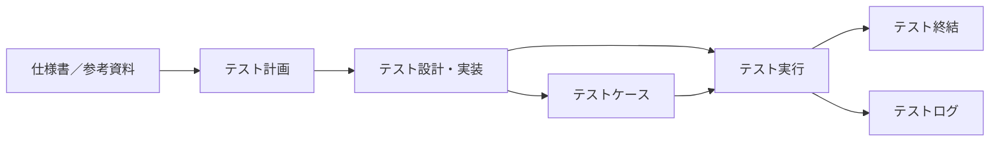

# Test Plan

| 項目 | 内容 |
| --- | --- |
| テスト対象システム名 | <記載> |
| テストレベル／テストタイプ | <記載> |
| ドキュメント識別番号 | <記載> |
| Ver. | `0.0.0` |
| 作成年月日 | <YYYY年MM月DD日> |
| 発行組織 | <記載> |
| 作成者氏名 | <記載> |

<!-- ドキュメント識別番号はプロジェクトに応じて決定する。 -->

<!-- 組織名称、作成者氏名を明記する。 -->

## 改訂履歴

| 改訂日 | バージョン （またはステータス） | 作成/改訂者 | 承認者 | 改訂内容及び理由 |
| --- | --- | --- | --- | --- |
|  |  |  |  |  |
|  |  |  |  |  |
|  |  |  |  |  |
|  |  |  |  |  |
|  |  |  |  |  |
|  |  |  |  |  |
|  |  |  |  |  |

## 目次

| 章 | 内容 |
| --- | --- |
| 1 | はじめに |
| 1.1 | 本ドキュメントの位置づけ |
| 2 | 概要 |
| 2.1 | 本書の対象 |
| 2.2 | リファレンス（参考資料）およびテストベース |
| 3 | テストの状況 |
| 3.1 | テストの背景 |
| 3.2 | テストの目的および目標 |
| 4 | プロジェクト全体における位置づけ |
| 4.1 | 対象テストレベル |
| 4.2 | プロジェクト全体の状況 |
| 4.3 | 具体的な改修内容 |
| 4.4 | テストアイテム |
| 4.5 | テストタイプ |
| 5 | テスト作業全体の流れと成果物 |
| 6 | テストスコープ |
| 6.1 | テスト対象システムイメージ |
| 6.2 | テスト対象範囲 |
| 7 | プロダクトリスク |
| 7.1 | プロダクトリスク |
| 8 | テスト設計方針 |
| 8.1 | 各機能における観点（大分類／中分類） |
| 8.2 | テストアイテム別重要度 |
| 8.3 | 観点重要度 |
| 8.4 | 機能重要度 |
| 8.5 | テストに用いる技法 |
| 9 | スケジュールと成果物 |
| 9.1 | テスト期間 |
| 9.2 | スケジュール |
| 9.3 | 成果物 |
| 9.4 | 見積 |
| 10 | テスト実施時の各種判定基準 |
| 10.1 | テスト開始／終了基準 |
| 10.2 | テスト中断／再開基準 |
| 10.3 | テスト完了基準 |
| 10.4 | 再テスト／リグレッションテスト実施条件 |
| 10.5 | テスト実施結果の判定基準 |
| 10.6 | インシデント判定基準 |
| 10.7 | 質問事項重要度の判定基準 |
| 10.8 | テスト実行時の記録について |
| 11 | 収集するメトリクス |
| 11.1 | 収集するメトリクス |
| 12 | テスト環境要件およびテストデータ要件 |
| 12.1 | テスト環境要件 |
| 12.2 | テストデータ要件 |
| 13 | コミュニケーション・テスト体制 |
| 13.1 | コミュニケーション／定期報告方針 |
| 13.2 | インシデントの報告および運用の流れ |
| 13.3 | テスト体制 |
| 13.4 | テスト作業場所 |
| 13.5 | ステークホルダー |
| 13.6 | 採用ニーズ |
| 13.7 | トレーニングの必要性 |
| 13.8 | テスト実施者の独立性 |
| 14 | 予見できるリスクとその対応方針 |
| 14.1 | 予見できるリスクとその対応方針 |
| 14.2 | プロジェクトリスク |
| 15 | 前提条件と制限事項 |
| 16 | 用語集および参考文献 |
| 16.1 | 用語集 |
| 16.2 | 参考文献 |
| 17 | 特記事項 |

## 1. はじめに

### 1.1 本ドキュメントの位置づけ

本ドキュメントは、「1 はじめに」に記載するテストにおけるテスト計画について記載するものである。

テスト設計・実装および、テストケースを作成し、テストを実行する際の指針となるドキュメントである。

## 2. 概要

### 2.1 本書の対象

本書の対象は、以下の通り。

| 項目 | 内容 |
| --- | --- |
| 名称 | <記載> |
| 対象ユーザー | <記載> |
| システム目的 | <記載> |
| システム詳細 | <記載> |
| 開発分類および内容 | <記載> |

<!-- 詳細を書くことでテストのスコープを明確化する。 -->

### 2.2 リファレンス（参考資料）およびテストベース

本書を作成するにあたり、参照した資料の一覧を記載する。

| No | 資料名称 | 作成者 | Ver | 受領日 | 備考 |
| --- | --- | --- | --- | --- | --- |
| 1 |  |  |  |  |  |
| 2 |  |  |  |  |  |
| 3 |  |  |  |  |  |
| 4 |  |  |  |  |  |
| 5 |  |  |  |  |  |
| 6 |  |  |  |  |  |
| 7 |  |  |  |  |  |
| 8 |  |  |  |  |  |
| 9 |  |  |  |  |  |
| 10 |  |  |  |  |  |

<!-- 参考資料、資料の場所などを記載する。 -->

## 3. テストの状況

### 3.1 テストの背景

本テストにおける実施の背景を以下に記載する。

| 項目 | 内容 |
| --- | --- |
| 現在の状況 | <記載> |
| 問題点/懸念事項 | <記載> |

<!-- 背景、実施において求められることを記載する。 -->

### 3.2 テストの目的および目標

本テストにおける目的および目標を以下に記載する。

| 項目 | 内容 |
| --- | --- |
| テストの目的 | <記載> |
| テストの目標 | <記載> |

<!-- 目的は、端的に文章でまとめて記載する。 -->

<!-- テストアイテムの目的にならないこと。 -->

<!-- 目的が複数ある場合は目的①、目的②・・・と明記する。 -->

## 4. プロジェクト全体における位置づけ

### 4.1 対象テストレベル

本書の対象テストレベルを以下に記載する。

| 項目 | 内容 |
| --- | --- |
| テストレベル | <記載> |

### 4.2 プロジェクト全体の状況

本プロジェクトにおける開発工程とその状況を、以下に記載する。

| 開発工程/テストレベル | 進捗状況 | 特記事項 |
| --- | --- | --- |
| 要件定義 | <記載> | <記載> |
| 基本設計 | <記載> | <記載> |
| 詳細設計 | <記載> | <記載> |
| 実装 | <記載> | <記載> |
| 単体テスト | <記載> | <記載> |
| 結合テスト | <記載> | <記載> |
| システムテスト | <記載> | <記載> |

<!-- プロジェクトに応じて修正する。 -->

### 4.3 具体的な改修内容

本テスト対象の改修内容は以下の通り。

- <記載>

- <記載>

- <記載>

- <記載>

- <記載>

- <記載>

<!-- 派生開発や、バージョンアップの場合、具体的な改修ポイントを記載する。 -->

<!-- プロジェクトに応じて修正する。 -->

### 4.4 テストアイテム

本テストの対象となる製品の詳細を、下記に記載する。

| No. | テストアイテム | 概要 |
| --- | --- | --- |
| 1 |  |  |
| 2 |  |  |

#### テストアイテムの説明

- <記載>

- <記載>

- <記載>

<!-- 量が多い場合は、別資料にしてもよい。 -->

### 4.5 テストタイプ

本テストの対象は以下の通りである。

|  | 1 | 2 | 3 | 4 | 5 | 6 | 7 | 8 | 9 | 10 |
| --- | --- | --- | --- | --- | --- | --- | --- | --- | --- | --- |
| 実施対象のテスト | 機能テスト | シナリオ | 性能テスト | ロードテスト | ストレステスト | ユーザビリティテスト | ローカライゼーションテスト | 保守性テスト | 信頼性テスト | 移植性テスト |
| 本テストの対象＝〇 |  |  |  |  |  |  |  |  |  |  |

| テストタイプ | 説明（参考） |
| --- | --- |
| 機能テスト | テスト対象のソフトウェアまたはアプリケーションの「機能」が期待どおりの結果を返すか確かめるテスト |
| シナリオテスト | 利用者の実際の利用手順に沿って操作を行い、問題なく利用できるか確かめるテスト |
| 性能テスト | ソフトウェアの処理時間などのパフォーマンスを測定するテスト |
| ロードテスト | ソフトウェアを、様々な状況で動作させて、期待どおりの結果を返すか確かめるテスト |
| ストレステスト | ソフトウェアが要件で定義される限界、もしくはそれ以上の負荷を与えて動作を確かめるテスト |
| ユーザビリティテスト | ソフトウェアが、ユーザーにとって理解されやすく、使いやすく、魅力的であるかどうかを確かめるテスト |
| ローカライゼーションテスト | 異なる言語を使用してアプリケーションに変換されたときにソフトウェアが機能することを確認するためのテスト |
| 保守性テスト | ソフトウェアに欠陥があった場合の修正のしやすさや、新しい機能の追加しやすさなどを確かめるテスト |
| 信頼性テスト | ソフトウェアが要件で決めた回数や、期間や、条件で稼動できるかを確かめるテスト（大容量テスト、エージングテストなど） |
| 移植性テスト | 将来的に、ソフトウェアを別なハードウェアや、環境に移すことになった際の移植のしやすさを確かめるテスト |

## 5. テスト作業全体の流れと成果物

本テストでは、下記の作業を行うこととする。

### <全体イメージ>

### <中間生成物>

| テストフェーズ | 作業内容 | 中間生成物（※1） | 成果物（※2） |
| --- | --- | --- | --- |
| テスト計画 | <記載> | <記載> | <記載> |
| テスト設計・実装 | <記載> | <記載> | <記載> |
| テスト実行 | <記載> | <記載> | <記載> |
| テスト終結 | <記載> | <記載> | <記載> |

※1 中間生成物はテスト内容に合わせて変動する。

※2 成果物はプロジェクトで採用する文書体系に応じて調整する。

## 6. テストスコープ

### 6.1 テスト対象システムイメージ

<プロジェクトの内容に合わせてイメージ図を作成する>

### 6.2 テスト対象範囲

本テストの対象／非対象となる、機能および範囲を下記に記載する。

#### テスト対象機能

| No | 機能（大分類） | 概要 |
| --- | --- | --- |
| <記載> | <記載> | <記載> |
| <記載> | <記載> | <記載> |
| <記載> | <記載> | <記載> |
| <記載> | <記載> | <記載> |

#### テスト非対象機能

| No | 機能（大分類） | 概要 |
| --- | --- | --- |
| <記載> | <記載> | <記載> |
| <記載> | <記載> | <記載> |
| <記載> | <記載> | <記載> |
| <記載> | <記載> | <記載> |

## 7. プロダクトリスク

### 7.1 プロダクトリスク

事前に評価、分析されたプロダクトリスク、およびリスク低減策は下記の通り。

分析の内容およびリスク低減策をもとに、テスト設計にてテストの優先順位付けを行います。

<プロダクトリスクの図表を記載するか、別資料の参照先を記載する>

<!-- リスクを図表で作成する。別紙参照とする場合、その旨を記載して図表は削除する。 -->

## 8. テスト設計方針

### 8.1 各機能における観点（大分類／中分類）

観点（大分類／中分類）

| 機能（大分類／中分類） | 1 | 2 | 3 | 4 | 5 | 6 | 7 | 8 | 9 | 10 | 11 | 12 |
| --- | --- | --- | --- | --- | --- | --- | --- | --- | --- | --- | --- | --- |
| 1 |  |  |  |  |  |  |  |  |  |  |  |  |
| 2 |  |  |  |  |  |  |  |  |  |  |  |  |
| 3 |  |  |  |  |  |  |  |  |  |  |  |  |
| 4 |  |  |  |  |  |  |  |  |  |  |  |  |
| 5 |  |  |  |  |  |  |  |  |  |  |  |  |
| 6 |  |  |  |  |  |  |  |  |  |  |  |  |
| 7 |  |  |  |  |  |  |  |  |  |  |  |  |
| 8 |  |  |  |  |  |  |  |  |  |  |  |  |

<!-- テスト対象に応じて修正する。 -->

### 8.2 テストアイテム別重要度

各テストアイテムにおいて、テスト実施時の確認重要度（重点的に実施：A>B>Ｃ：最低限実施）は下記の通りとする。

| No | テストアイテム | 重要度 | 設定理由 |
| --- | --- | --- | --- |
| 1 | <記載> | <記載> | <記載> |
| 2 | <記載> | <記載> | <記載> |
| 3 | <記載> | <記載> | <記載> |
| 4 | <記載> | <記載> | <記載> |

<!-- テスト対象に応じて修正する。 -->

### 8.3 観点重要度

各テスト観点において、テスト実施時の確認重要度（重点的に実施：A>B>Ｃ：最低限実施）は下記の通りとする。

| No | 観点（大分類） | 重要度 | 設定理由 |
| --- | --- | --- | --- |
| 1 | <記載> | <記載> | <記載> |
| 2 | <記載> | <記載> | <記載> |
| 3 | <記載> | <記載> | <記載> |
| 4 | <記載> | <記載> | <記載> |

<!-- テスト対象に応じて修正する。プロダクトリスクのリスクスコアを重要度に反映する。 -->

### 8.4 機能重要度

各機能（大分類）において、テスト実施時の確認重要度（重点的に実施：A>B>Ｃ：最低限実施）は下記の通りとする。

| No | 機能（大分類） | 重要度 | 設定理由 |
| --- | --- | --- | --- |
| 1 | <記載> | <記載> | <記載> |
| 2 | <記載> | <記載> | <記載> |
| 3 | <記載> | <記載> | <記載> |
| 4 | <記載> | <記載> | <記載> |

<!-- テスト対象に応じて修正する。プロダクトリスクのリスクスコアを重要度に反映する。 -->

### 8.5 テストに用いる技法

各テストアプローチに対して、使用するテスト技法を選定する。

| No | テストタイプ | アプローチ内容 | 使用する技法 |
| --- | --- | --- | --- |
| 1 |  |  |  |
| 2 |  |  |  |
| 3 |  |  |  |
| 4 |  |  |  |
| 5 |  |  |  |
| 6 |  |  |  |
| 7 |  |  |  |
| 8 |  |  |  |
| 9 |  |  |  |
| 10 |  |  |  |

<!-- スコープに対してどのテスト設計技法を用いるかを指定する。 -->

## 9. スケジュールと成果物

### 9.1 テスト期間

本テスト全体の期間の予定を以下に記載する。

| 作業内容 | 予定期間 | 工数（単位） |
| --- | --- | --- |
| テスト全体 | <開始>～<終了> | <記載> |
| 仕様理解 | <開始>～<終了> | <記載> |
| テスト計画 | <開始>～<終了> | <記載> |
| テスト設計 | <開始>～<終了> | <記載> |
| テスト実装 | <開始>～<終了> | <記載> |
| テスト実行 | <開始>～<終了> | <記載> |
| テスト終結 | <開始>～<終了> | <記載> |

### 9.2 スケジュール

本テストは、下記のスケジュールに沿って行う。

<table>
  <thead>
    <tr>
      <th rowspan="3">作業内容</th>
      <th colspan="18">スケジュール</th>
    </tr>
    <tr>
      <th colspan="3">12月</th>
      <th colspan="3">1月</th>
      <th colspan="3">2月</th>
      <th colspan="3">3月</th>
      <th colspan="3">4月</th>
      <th colspan="3">5月</th>
    </tr>
    <tr>
      <th>上</th><th>中</th><th>下</th>
      <th>上</th><th>中</th><th>下</th>
      <th>上</th><th>中</th><th>下</th>
      <th>上</th><th>中</th><th>下</th>
      <th>上</th><th>中</th><th>下</th>
      <th>上</th><th>中</th><th>下</th>
    </tr>
  </thead>
  <tbody>
    <tr>
      <td>マイルストーン</td>
      <td></td><td>▲ 12/15 結合テスト開始</td><td></td>
      <td></td><td>▲ 1/16 結合テスト完了 ● 1/16 結合テストサマリ提出</td><td></td>
      <td></td><td></td><td></td>
      <td></td><td>▲ 受入テスト開始</td><td>▲ 受入テスト完了 ● 3/27 受入テストサマリ提出</td>
      <td></td><td></td><td></td>
      <td></td><td></td><td></td>
    </tr>
    <tr>
      <td>仕様理解</td>
      <td></td><td>━━▶</td><td></td>
      <td></td><td></td><td></td>
      <td></td><td></td><td></td>
      <td></td><td></td><td></td>
      <td></td><td></td><td></td>
      <td></td><td></td><td></td>
    </tr>
    <tr>
      <td>テスト計画</td>
      <td></td><td>━━</td><td>▶</td>
      <td></td><td></td><td></td>
      <td></td><td></td><td></td>
      <td></td><td></td><td></td>
      <td></td><td></td><td></td>
      <td></td><td></td><td></td>
    </tr>
    <tr>
      <td>└ テスト計画書作成</td>
      <td></td><td>━━</td><td>▶</td>
      <td></td><td></td><td></td>
      <td></td><td></td><td></td>
      <td></td><td></td><td></td>
      <td></td><td></td><td></td>
      <td></td><td></td><td></td>
    </tr>
    <tr>
      <td>テスト設計</td>
      <td></td><td>━━</td><td>━━▶</td>
      <td></td><td></td><td></td>
      <td></td><td></td><td></td>
      <td></td><td></td><td></td>
      <td></td><td></td><td></td>
      <td></td><td></td><td></td>
    </tr>
    <tr>
      <td>├ テスト設計仕様書作成</td>
      <td></td><td>━━</td><td>▶</td>
      <td></td><td></td><td></td>
      <td></td><td></td><td></td>
      <td></td><td></td><td></td>
      <td></td><td></td><td></td>
      <td></td><td></td><td></td>
    </tr>
    <tr>
      <td>├ テストマップ作成</td>
      <td></td><td></td><td>━━▶</td>
      <td></td><td></td><td></td>
      <td></td><td></td><td></td>
      <td></td><td></td><td></td>
      <td></td><td></td><td></td>
      <td></td><td></td><td></td>
    </tr>
    <tr>
      <td>└ テスト明細作成</td>
      <td></td><td></td><td>━━▶</td>
      <td></td><td></td><td></td>
      <td></td><td></td><td></td>
      <td></td><td></td><td></td>
      <td></td><td></td><td></td>
      <td></td><td></td><td></td>
    </tr>
    <tr>
      <td>結合テスト実施①</td>
      <td></td><td></td><td>━━</td>
      <td>━━</td><td>━━▶</td><td></td>
      <td></td><td></td><td></td>
      <td></td><td></td><td></td>
      <td></td><td></td><td></td>
      <td></td><td></td><td></td>
    </tr>
    <tr>
      <td>├ 結合テストケース作成</td>
      <td></td><td></td><td>━━▶</td>
      <td></td><td></td><td></td>
      <td></td><td></td><td></td>
      <td></td><td></td><td></td>
      <td></td><td></td><td></td>
      <td></td><td></td><td></td>
    </tr>
    <tr>
      <td>├ 結合テスト環境構築</td>
      <td></td><td></td><td>━━▶</td>
      <td></td><td></td><td></td>
      <td></td><td></td><td></td>
      <td></td><td></td><td></td>
      <td></td><td></td><td></td>
      <td></td><td></td><td></td>
    </tr>
    <tr>
      <td>├ 結合テストデータ作成</td>
      <td></td><td></td><td>━━▶</td>
      <td></td><td></td><td></td>
      <td></td><td></td><td></td>
      <td></td><td></td><td></td>
      <td></td><td></td><td></td>
      <td></td><td></td><td></td>
    </tr>
    <tr>
      <td>├ 結合テスト実施</td>
      <td></td><td></td><td></td>
      <td>━━</td><td>━━▶</td><td></td>
      <td></td><td></td><td></td>
      <td></td><td></td><td></td>
      <td></td><td></td><td></td>
      <td></td><td></td><td></td>
    </tr>
    <tr>
      <td>└ 結合テスト報告提出</td>
      <td></td><td></td><td></td>
      <td></td><td>● 1/16</td><td></td>
      <td></td><td></td><td></td>
      <td></td><td></td><td></td>
      <td></td><td></td><td></td>
      <td></td><td></td><td></td>
    </tr>
    <tr>
      <td>テスト実施②</td>
      <td></td><td></td><td></td>
      <td></td><td></td><td></td>
      <td></td><td></td><td></td>
      <td></td><td>━━</td><td>━━▶</td>
      <td></td><td></td><td></td>
      <td></td><td></td><td></td>
    </tr>
    <tr>
      <td>├ 受入テストケース作成</td>
      <td></td><td></td><td></td>
      <td></td><td></td><td></td>
      <td></td><td></td><td></td>
      <td></td><td>━━▶</td><td></td>
      <td></td><td></td><td></td>
      <td></td><td></td><td></td>
    </tr>
    <tr>
      <td>├ 受入テスト環境構築</td>
      <td></td><td></td><td></td>
      <td></td><td></td><td></td>
      <td></td><td></td><td></td>
      <td></td><td>━━▶</td><td></td>
      <td></td><td></td><td></td>
      <td></td><td></td><td></td>
    </tr>
    <tr>
      <td>├ 受入テストデータ作成</td>
      <td></td><td></td><td></td>
      <td></td><td></td><td></td>
      <td></td><td></td><td></td>
      <td></td><td>━━▶</td><td></td>
      <td></td><td></td><td></td>
      <td></td><td></td><td></td>
    </tr>
    <tr>
      <td>├ 受入テスト実施</td>
      <td></td><td></td><td></td>
      <td></td><td></td><td></td>
      <td></td><td></td><td></td>
      <td></td><td>━━</td><td>━━▶</td>
      <td></td><td></td><td></td>
      <td></td><td></td><td></td>
    </tr>
    <tr>
      <td>└ 受入テスト報告提出</td>
      <td></td><td></td><td></td>
      <td></td><td></td><td></td>
      <td></td><td></td><td></td>
      <td></td><td></td><td>● 3/27</td>
      <td></td><td></td><td></td>
      <td></td><td></td><td></td>
    </tr>
  </tbody>
</table>

<!-- スケジュール表を作成。リスクスコアに応じてアクティビティの優先順位を考慮。以下例。 -->

### 9.3 成果物

本テストの成果物を以下に記載する。

| 成果物名 | 成果物概要 | 納期 |
| --- | --- | --- |
| <記載> | <記載> | <記載> |
| <記載> | <記載> | <記載> |
| <記載> | <記載> | <記載> |
| <記載> | <記載> | <記載> |

<!-- テスト対象に応じて記載する。 -->

### 9.4 見積

本書に基づく見積は別紙をご参照ください。

<見積資料の参照先>

## 10. テスト実施時の各種判定基準

### 10.1 テスト開始/終了基準

本テストにおける運用について、下記に記載する。

<テスト開始基準/終了基準>

| 基準 | 条件 |
| --- | --- |
| テスト開始基準 | <記載> |
| テスト終了基準 | <記載> |

### 10.2 テスト中断/再開基準

本テストにおける運用について、下記に記載する。

テストの中断／再開については、■■において都度協議する。

※ リグレッションテストは、その時点でのリスクにもとづきテストマネージャーの裁量で実施する。

<中断基準/再開基準>

| 基準 | 条件 |
| --- | --- |
| テスト中断基準 | <記載> |
| テスト再開基準 | <記載> |

### 10.3 テスト完了基準

本テストにおける運用について、下記に記載する。

<テスト完了基準>

| 基準 | 条件 |
| --- | --- |
| テスト完了基準 |  |
| テスト完了基準 |  |
| テスト完了基準 |  |
| テスト完了基準 |  |

<!-- テスト完了基準の事例を列挙しているため、必要に応じてカスタマイズする。 -->

### 10.4 再テスト/リグレッションテスト実施条件

<再テスト/リグレッションテスト実施条件>

| 基準 | 条件 |
| --- | --- |
| 再テスト | <記載> |
| リグレッションテスト | <記載> |

### 10.5 テスト実施結果の判定基準

本テストにおける運用について、下記に記載する。

| ステータス | 説明 | 判定基準／判定例 |
| --- | --- | --- |
| OK | 問題なくテストが完了した項目 | <記載> |
| NG | インシデントが検出された項目 | <記載> |
| QA | QA表で質問中の項目 | <記載> |
| NT | テストを実施しない項目 ※同義語：テスト対象外 | <記載> |
| N/A | テスト実施ができない項目 ※同義語：不可、機能削除、Dropなど | <記載> |
| 保留 | 最終的には実施可能であるが、現状は、何らかの事情で実施ができない項目 | <記載> |

<!-- テスト実行時のログ記録について取り決めがある場合は記載する。 -->

### 10.6 インシデント判定基準

インシデントを検出した際には、以下の判定表に基づいてランクを決定する。

| ランク | 説明 |
| --- | --- |
| ランクA | 基本操作で機能が正常に動作しない 仕様、マニュアルと異なる動作 ユーザーが回避操作不能（フリーズ、リセットなど） |
| ランクB | ある条件において正常に動作しない 通常想定される性能を大きく下回る ユーザーが回避操作可能 |
| ランクC | 特殊条件において機能が正常に動作しない 通常想定される性能をやや下回る 仕様と区別がつかない |
| ランクD | 機能、性能、表示系などに対する要望や改良などの提案 |

<!-- 必要に応じてカスタマイズする。 -->

### 10.7 質問事項重要度の判定基準

質問事項発生の際には、下記の判定表に基づいて重要度を決定する。

| 重要度 | 説明 |
| --- | --- |
| 高 | テスト実施進捗に影響のおよぶテストケースの数が●件以上ある質問 仕様書のバージョンが更新される際に、変更された機能 |
| 中 | テスト実施進捗に影響のおよぶテストケースの数が○～●件の質問 仕様書にて、操作手順が不明 |
| 低 | テスト実施進捗に影響のおよぶテストケースの数が○件までの質問 画面レイアウトや文字の表示位置に関する質問 |

<!-- 必要に応じてカスタマイズする。 -->

### 10.8 テスト実行時の記録について

① テスト実行ログの記録は、テスト実施日、テスト実施者、テスト実行環境（バージョンなど）、判定結果を記録します。

② テスト判定結果が「NG」の場合、インシデント発行し、管理IDを記録します。

※ その際、必要に応じて不具合発生時の画面キャプチャを残す場合があります。

③ 再テストが「OK」の場合、インシデントを更新します。

<!-- 必要に応じてカスタマイズする。 -->

## 11. 収集するメトリクス

### 11.1 収集するメトリクス

テスト完了時に作成するテストサマリレポートでは、テスト設計～テスト実施時に収集したデータを基に分析を行う。

以下に、本プロジェクトの分析のためにサマリレポートに記載する項目、および必要なデータをまとめる。

| 記載対象項目 | 必要データ | 開発提供 | 記載対象 |
| --- | --- | --- | --- |
| インシデント曲線 | テスト実施日/不具合件数/未解決件数 | － | 〇 |
| インシデント機能別（パレート図） | 機能別の不具合件数/累積割合 | － | 〇 |
| インシデント発生率 | テスト項目ごとの実施件数/不具合件数 | － | 〇 |
| 不具合検出率 | 検出済不具合総数/テストケース総数 | － | 〇 |
| 不具合収束状況 | 期間内の検出済不具合数/期間内のテスト実施時間 | － | 〇 |
|  |  |  |  |
|  |  |  |  |

凡例

〇：記載対象

×：記載非対象

<!-- 関係者と相談のうえで、記載対象を決定する。 -->

## 12. テスト環境要件およびテストデータ要件

### 12.1 テスト環境要件

テスト環境要件は以下の通り。

テスト開始前までに、テスト開始条件を満たすことを確認します。

| No. | 検証環境 | 機材 | 検証環境要件詳細 | 提供 | 期間 |
| --- | --- | --- | --- | --- | --- |
| 1 | <記載> | <記載> | <記載> | <記載> | <記載> |
| 2 | <記載> | <記載> | <記載> | <記載> | <記載> |
| 3 | <記載> | <記載> | <記載> | <記載> | <記載> |
| 4 | <記載> | <記載> | <記載> | <記載> | <記載> |
| 5 | <記載> | <記載> | <記載> | <記載> | <記載> |

また、テストアイテムの比較対象として以下の機材を使用する。

　ベンチマーク時の他社比較機として使用

| No. | 型番 | FW Ver | スペック | 備考 |
| --- | --- | --- | --- | --- |
| 1 | <記載> | <記載> | <記載> | <記載> |
| 2 | <記載> | <記載> | <記載> | <記載> |
| 3 | <記載> | <記載> | <記載> | <記載> |

<!-- PC、スマートフォン、サーバー環境、提供元といった情報を記述する。 -->

<!-- 比較対象機材が不必要な場合は、削除する。 -->

### 12.2 テストデータ要件

本テストは、下記の要件が揃ったことを確認した後に、テストを開始する。

| ID | 説明 | 責任部門 | 期間 | リセット | アーカイブ |
| --- | --- | --- | --- | --- | --- |
| ID1 | <記載> | <記載> | <記載> | <記載> | <記載> |
| ID2 | <記載> | <記載> | <記載> | <記載> | <記載> |
| ID3 | <記載> | <記載> | <記載> | <記載> | <記載> |

※ リセットとは、要求に応じて責任部門がオリジナルのデータベースを復元する必要があることを意味します。

※ テストデータの詳細は、テスト設計仕様書にて記載する。

## 13. コミュニケーション・テスト体制

### 13.1 コミュニケーション/定期報告方針

本テストでは、下記の要領に基づいて報告を行うものとする。

| 報告内容 | 手段 | タイミング |
| --- | --- | --- |
| テスト設計・仕様に関する質問 | <課題管理ツール／チャット／メール等> | 随時 |
| 進捗報告 | <会議／チャット／メール等> | <頻度・時刻> |
| インシデント報告 | <課題管理ツール等> | 随時 |
| 緊急連絡 | <電話／チャット／メール等> | 随時 |

<!-- プロジェクトの連絡手段、報告頻度、エスカレーション経路に合わせて定義する。 -->

<!-- 関係者と相談のうえで決定する。 -->

### 13.2 インシデントの報告および運用の流れ

インシデントを検出した際の対応について、以下に流れを記載する。

<インシデント掲出時の報告の流れを図で記載する>

<!-- 関係者と相談のうえで決定する。 -->

### 13.3 テスト体制

本テストにおけるテスト体制を以下に記載する。

<テストの実施体制を図で記載する>

### 13.4 テスト作業場所

本テストは、下記の作業場所にて行う。

<テストの作業場所を記載する>

### 13.5 ステークホルダー

| 役割 | 役割 | 氏名 | 連絡先 |
| --- | --- | --- | --- |
| 開発PM | <記載> | <記載> | <記載> |
| 開発リーダー | <記載> | <記載> | <記載> |
| 開発担当 | <記載> | <記載> | <記載> |
| 開発担当 | <記載> | <記載> | <記載> |
| テストチームリーダー | <記載> | <記載> | <記載> |
| テスト設計担当 | <記載> | <記載> | <記載> |
| テスト実施担当 | <記載> | <記載> | <記載> |
| テスター | <記載> | <記載> | <記載> |
| テスター | <記載> | <記載> | <記載> |

### 13.6 採用ニーズ

<テスト実施に必要な役割、スキル、人数、追加要員の要否を記載する。追加要員が不要な場合はその旨を記載する。>

### 13.7 トレーニングの必要性

<対象システム、テスト技法、テスト管理ツール等について事前教育が必要な場合、その対象者、内容、実施時期を記載する。>

### 13.8 テスト実施者の独立性

<開発担当者とテスト設計者・実施者の関係、レビュー体制、独立性を確保する必要がある場合の方針を記載する。>

## 14. 予見できるリスクとその対応方針

### 14.1 予見できるリスクとその対応方針

テスト業務を行う上において、予見できるリスクとその対応について下記に記す。

| No. | 予見できるリスク | 対応方針 |
| --- | --- | --- |
| <記載> | <記載> | <記載> |
| <記載> | <記載> | <記載> |
| <記載> | <記載> | <記載> |
| <記載> | <記載> | <記載> |
| <記載> | <記載> | <記載> |
| <記載> | <記載> | <記載> |
| <記載> | <記載> | <記載> |
| <記載> | <記載> | <記載> |

<!-- 事前に予見できるリスク、対応方針を明記する。 -->

### 14.2 プロジェクトリスク

現時点のプロジェクトリスク登録表は下記の通り。

<プロジェクトリスク登録表を記載する>

<!-- スケジュール遅延、予算への過剰な負担など、プロジェクトの成果に影響を及ぼす要因を記載する。 -->

## 15. 前提条件と制限事項

### 前提条件

1. 仕様や開発スケジュール、テスト対象範囲に大幅な変更が発生した場合は本計画書の見直しを行います。
2. テスト環境について、準備遅延やメンテナンス等により、作業への支障が発生する場合は、○営業日前までにご連絡いただくものとします。

### 制約事項

1. <ある場合、記載する>
2. <記載>

<!-- 本書に記載された内容についての、前提条件や制約事項があれば記載する。なければ削除可能。 -->

## 16. 用語集および参考文献

### 16.1 用語集

本書で用いる用語、略語、頭字語は以下の通り。

| 用語 | 解説 |
| --- | --- |
|  |  |
|  |  |
|  |  |
|  |  |
|  |  |
|  |  |
|  |  |
|  |  |
|  |  |

### 16.2 参考文献

本書の作成にあたり参考にした文献は下記の通り。

| 文献名 | 説明 |
| --- | --- |
|  |  |
|  |  |
|  |  |
|  |  |
|  |  |
|  |  |
|  |  |
|  |  |
|  |  |

## 17. 特記事項

<記載>
