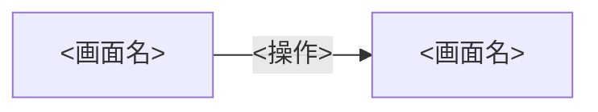

# 画面遷移とURL

| 項目 | 内容 |
| --- | --- |
| バージョン | 0.1.0 |
| ステータス | draft |
| 最終更新日 | <YYYY-MM-DD> |
| 責任者 | <氏名または役割> |

---

## 1. URL

| 画面 | URLまたはルート | パスパラメーター | クエリパラメーター |
| --- | --- | --- | --- |
| <SCR-DOMAIN-001> | <URLまたはルート> | <名称、意味、存在しない場合の処理> | <名称、型、初期値、許可値、URLへの保持条件> |

---

## 2. 画面遷移

| 遷移元 | 契機 | 条件 | 遷移先 | ブラウザ履歴 |
| --- | --- | --- | --- | --- |
| <SCR-DOMAIN-001> | <操作または事象> | <遷移が成立する条件> | <SCR-DOMAIN-002> | <追加、置換、履歴へ残さないのいずれか> |

遷移の全体像は次の図で補足する。遷移の正はこの章の表とする。

---

## 3. 戻る操作

| 操作 | 動作 |
| --- | --- |
| ブラウザバック | <動作> |
| OS標準の戻る操作 | <動作> |
| 画面内の戻るボタン | <動作> |
| 送信完了後の戻る操作 | <再送信を防ぐ動作> |

---

## 4. ディープリンク

| 状況 | 動作 |
| --- | --- |
| 未認証 | <遷移先と、認証後に元のURLへ戻すかどうか> |
| 権限不足 | <遷移先または表示内容> |
| 対象データが存在しない | <遷移先または表示内容> |
| パラメーターが不正 | <遷移先または表示内容> |

---

## 5. 再読み込み

| 対象 | 保持の可否 |
| --- | --- |
| 入力値 | <保持するかどうかと、その手段> |
| 検索条件 | <保持するかどうかと、その手段> |
| 選択状態 | <保持するかどうかと、その手段> |
| ページ番号 | <保持するかどうかと、その手段> |
