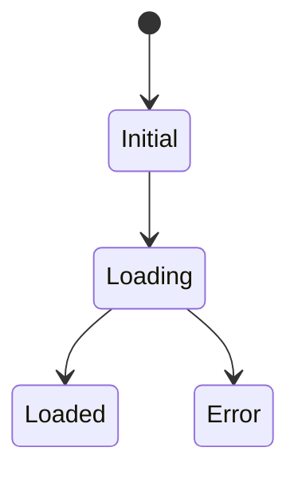

# <SCR-DOMAIN-NNN> <画面名>

## 1. 基本情報

| 項目 | 内容 |
| --- | --- |
| バージョン | 0.1.0 |
| ステータス | draft |
| 最終更新日 | <YYYY-MM-DD> |
| 責任者 | <氏名または役割> |
| URL | <URLまたはルート> |
| 閲覧できるロール | <ロール名> |
| デザイン | <デザインファイルのURL> |

---

## 2. 画面概要

<この画面で利用者が達成することを2文以内で記載する。>

---

## 3. 表示項目

| 識別子 | 項目名 | 取得元 | 初期値 | 表示条件 | 欠損時の表示 | 表示形式 |
| --- | --- | --- | --- | --- | --- | --- |
| <FLD-DOMAIN-NNN-001> | <項目名> | <APIの識別子とフィールド名> | <初期値> | <表示する条件> | <値がない場合の表示> | <共通規約の表示形式、または差分> |

---

## 4. 入力項目

入力項目がない画面は「対象外」と理由を記載する。

| 識別子 | 項目名 | 入力形式 | 必須 | 初期値 | 制約 | 検証エラー |
| --- | --- | --- | --- | --- | --- | --- |
| <FLD-DOMAIN-NNN-002> | <項目名> | <テキスト、選択、日付などの形式> | <必須または任意> | <初期値> | <文字数、範囲、許可文字などの制約> | <MSG-VALIDATION-NNN> |

---

## 5. 操作

| 識別子 | 操作名 | 起点 | 実行条件 | 成功時 | 失敗時 | 連打防止 |
| --- | --- | --- | --- | --- | --- | --- |
| <ACT-DOMAIN-NNN-001> | <操作名> | <ボタンなどの起点> | <実行できる条件> | <成功時の表示と遷移> | <失敗時の表示> | <完了までの再実行を防ぐ方法> |

---

## 6. 一覧仕様

一覧を持たない画面は「対象外」と理由を記載する。

| 項目 | 内容 |
| --- | --- |
| 表示件数 | <1ページあたりの件数> |
| ページング | <ページ番号、無限スクロールなどの方式と、URLへの保持> |
| 既定の並び順 | <並び替えの基準と昇順降順> |
| 並び替え | <利用者が並び替えできる列> |
| 絞り込み | <絞り込み条件と、URLへの保持> |
| 行の操作 | <行を選択または実行したときの動作> |
| 0件時 | <Empty状態の表示と、次に実行できる操作> |

---

## 7. 状態

対象外の状態にも「対象外」と理由を記載し、空欄にしない。

| 状態 | 表示内容 |
| --- | --- |
| Initial | <表示内容> |
| Loading | <表示内容> |
| Loaded | <表示内容> |
| Empty | <表示内容> |
| Refreshing | <表示内容> |
| Submitting | <表示内容> |
| Error | <表示内容> |
| Forbidden | <表示内容> |
| SessionExpired | <表示内容> |
| Conflict | <表示内容> |

---

## 8. 状態遷移表

状態とイベントの組み合わせを総当たりで記載する。想定しない組み合わせにも「遷移なし」と明記する。

| 現在の状態 | イベント | 条件 | 遷移先 | アクション |
| --- | --- | --- | --- | --- |
| Initial | <EVT-DOMAIN-NNN-001> | <条件> | Loading | <実行する処理> |
| Loading | <EVT-DOMAIN-NNN-002> | <条件> | Loaded | <実行する処理> |
| Loading | <EVT-DOMAIN-NNN-003> | <条件> | Error | <実行する処理> |

視覚化として次の図を任意で添える。遷移の正はこの章の表とする。

---

## 9. API連携

| API | 契機 | 送信内容 | 成功時の反映 |
| --- | --- | --- | --- |
| <APIの識別子> | <呼び出す契機> | <送信するパラメーター> | <画面への反映内容> |

### HTTPステータス別の処理

| ステータス | 状態 | 表示 |
| --- | --- | --- |
| 200 | Loaded | <表示内容> |
| 400 | Loaded | <MSG-VALIDATION-NNN> |
| 401 | SessionExpired | <MSG-AUTH-NNN> |
| 403 | Forbidden | <MSG-AUTH-NNN> |
| 404 | <状態> | <表示内容> |
| 409 | Conflict | <MSG-CONFLICT-NNN> |
| 500 | Error | <MSG-NETWORK-NNN> |
| タイムアウト、通信断 | Error | <MSG-NETWORK-NNN> |

---

## 10. エラー処理

メッセージIDで参照し、文言を直接記述しない。

| 識別子 | 発生条件 | メッセージID | 表示位置 | 次に実行できる操作 |
| --- | --- | --- | --- | --- |
| <ERR-DOMAIN-NNN-001> | <エラーが発生する条件> | <MSG-CATEGORY-NNN> | <表示位置> | <再試行、修正などの操作> |

---

## 11. 権限制御

| 対象 | ロール | 動作 |
| --- | --- | --- |
| 画面の閲覧 | <ロール名> | <表示、または権限不足時の動作> |
| <ACT-DOMAIN-NNN-001> | <ロール名> | <表示、非表示、無効化のいずれか> |
| URL直接入力 | <権限のないロール> | <遷移先または表示内容> |
| APIの権限エラー | すべて | <UI側の表示状態に関係なく権限不足として処理する内容> |

---

## 12. レスポンシブ

共通規約と同じ場合は「共通規約に準拠」と記載し、差分だけを記述する。

| 対象 | <sm> | <md> | <lg> |
| --- | --- | --- | --- |
| <この画面固有のレイアウト> | <表示形態> | <表示形態> | <表示形態> |

---

## 13. アクセシビリティ

共通規約と同じ場合は「共通規約に準拠」と記載し、差分だけを記述する。

| 項目 | 内容 |
| --- | --- |
| 初期フォーカス | <フォーカス位置> |
| 見出し構造 | <見出しレベルの構成> |
| 動的な更新の通知 | <通知する内容と方法> |

---

## 14. 未保存変更

未保存の入力を持たない画面は「対象外」と理由を記載する。

| 項目 | 内容 |
| --- | --- |
| 判定条件 | <未保存と判定する条件> |
| 離脱時の確認 | <確認する操作と、確認しない操作> |
| 破棄した場合 | <破棄後の遷移先と表示> |

---

## 15. 受け入れ条件

| 識別子 | 前提 | 操作 | 期待する結果 |
| --- | --- | --- | --- |
| <AC-DOMAIN-NNN-001> | <検証開始時の状態> | <実行する操作> | <利用者から観測できる結果> |

---

## 16. 変更履歴

| バージョン | 日付 | 変更者 | 変更内容 | 承認者 |
| --- | --- | --- | --- | --- |
| 0.1.0 | <YYYY-MM-DD> | <氏名> | 初版を作成する。 | <氏名> |
